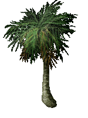
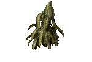
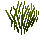
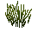
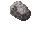
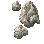

# Beach

_Generated on 2024-12-13 11:26:34_

## Coconut palm

| Item | ID (Hex) | X, Y, Z | Frequency |
|:----:|:--------:|:-------:|:---------:|
|  | 3221 (0x0C95) | 0, 0, 0 | 4 |

## Date palm

| Item | ID (Hex) | X, Y, Z | Frequency |
|:----:|:--------:|:-------:|:---------:|
|  | 3222 (0x0C96) | 0, 0, 0 | 4 |

## Small palm

| Item | ID (Hex) | X, Y, Z | Frequency |
|:----:|:--------:|:-------:|:---------:|
|  | 3225 (0x0C99) | 0, 0, 0 | 4 |
|  | 3226 (0x0C9A) | 0, 0, 0 | 4 |
|  | 3227 (0x0C9B) | 0, 0, 0 | 4 |
|  | 3228 (0x0C9C) | 0, 0, 0 | 4 |
|  | 3229 (0x0C9D) | 0, 0, 0 | 4 |

## Ponytail palm

| Item | ID (Hex) | X, Y, Z | Frequency |
|:----:|:--------:|:-------:|:---------:|
|  | 3238 (0x0CA6) | 0, 0, 0 | 4 |

## Banana tree (small)

| Item | ID (Hex) | X, Y, Z | Frequency |
|:----:|:--------:|:-------:|:---------:|
|  | 3240 (0x0CA8) | 0, 0, 0 | 2 |

## Banana tree 

| Item | ID (Hex) | X, Y, Z | Frequency |
|:----:|:--------:|:-------:|:---------:|
|  | 3242 (0x0CAA) | 0, 0, 0 | 2 |
|  | 3243 (0x0CAB) | 0, 0, 0 | 2 |

## Yucca 

| Item | ID (Hex) | X, Y, Z | Frequency |
|:----:|:--------:|:-------:|:---------:|
|  | 3383 (0x0D37) | 0, 0, 0 | 3 |
|  | 3384 (0x0D38) | 0, 0, 0 | 3 |

## Grasses

| Item | ID (Hex) | X, Y, Z | Frequency |
|:----:|:--------:|:-------:|:---------:|
|  | 3378 (0x0D32) | 0, 0, 0 | 5 |
|  | 3379 (0x0D33) | 0, 0, 0 | 7 |

## Rocks

| Item | ID (Hex) | X, Y, Z | Frequency |
|:----:|:--------:|:-------:|:---------:|
|  | 4962 (0x1362) | 0, 0, 0 | 1 |
|  | 4963 (0x1363) | 0, 0, 0 | 1 |
|  | 4965 (0x1365) | 0, 0, 0 | 5 |
|  | 4966 (0x1366) | 0, 0, 0 | 5 |
|  | 4967 (0x1367) | 0, 0, 0 | 5 |
|  | 4968 (0x1368) | 0, 0, 0 | 4 |
|  | 4969 (0x1369) | 0, 0, 0 | 1 |
|  | 4970 (0x136A) | 0, 0, 0 | 7 |
|  | 4971 (0x136B) | 0, 0, 0 | 4 |
|  | 4972 (0x136C) | 0, 0, 0 | 4 |
|  | 4973 (0x136D) | 0, 0, 0 | 4 |
|  | 6001 (0x1771) | 0, 0, 0 | 1 |
|  | 6002 (0x1772) | 0, 0, 0 | 1 |
|  | 6003 (0x1773) | 0, 0, 0 | 1 |
|  | 6004 (0x1774) | 0, 0, 0 | 1 |
|  | 6005 (0x1775) | 0, 0, 0 | 1 |
|  | 6006 (0x1776) | 0, 0, 0 | 1 |
|  | 6007 (0x1777) | 0, 0, 0 | 1 |
|  | 6008 (0x1778) | 0, 0, 0 | 1 |
|  | 6009 (0x1779) | 0, 0, 0 | 1 |
|  | 6010 (0x177A) | 0, 0, 0 | 4 |
|  | 6011 (0x177B) | 0, 0, 0 | 4 |
|  | 6012 (0x177C) | 0, 0, 0 | 4 |

## Shells

| Item | ID (Hex) | X, Y, Z | Frequency |
|:----:|:--------:|:-------:|:---------:|
|  | 4036 (0x0FC4) | 0, 0, 0 | 10 |
|  | 4038 (0x0FC6) | 0, 0, 0 | 10 |
|  | 4039 (0x0FC7) | 0, 0, 0 | 10 |
|  | 4044 (0x0FCC) | 0, 0, 0 | 10 |
|  | 4041 (0x0FC9) | 0, 0, 0 | 10 |
|  | 4042 (0x0FCA) | 0, 0, 0 | 10 |
|  | 4040 (0x0FC8) | 0, 0, 0 | 10 |
|  | 4042 (0x0FCA) | 0, 0, 0 | 10 |
|  | 4041 (0x0FC9) | 0, 0, 0 | 10 |
|  | 4036 (0x0FC4) | 0, 0, 0 | 10 |

## Beach Camp

| Item | ID (Hex) | X, Y, Z | Frequency |
|:----:|:--------:|:-------:|:---------:|
|  | 4041 (0x0FC9) | -2, 0, 0 | 10 |
|  | 4038 (0x0FC6) | 0, 2, 0 | 10 |
|  | 4036 (0x0FC4) | 0, 2, 0 | 10 |
|  | 4036 (0x0FC4) | 2, -1, 0 | 10 |
|  | 3221 (0x0C95) | 4, 0, 0 | 10 |
|  | 3222 (0x0C96) | 0, 0, 0 | 10 |
|  | 3225 (0x0C99) | 0, 1, 0 | 10 |
|  | 3378 (0x0D32) | 5, 0, 0 | 10 |
|  | 3378 (0x0D32) | 1, 2, 0 | 10 |
|  | 3378 (0x0D32) | 3, -1, 0 | 10 |
|  | 3379 (0x0D33) | 4, 1, 0 | 10 |
|  | 3379 (0x0D33) | 0, 1, 0 | 10 |
|  | 3233 (0x0CA1) | 5, 1, 0 | 10 |
