# Cave

_Generated on 2024-12-13 11:26:34_

## Cave

| Item | ID (Hex) | X, Y, Z | Frequency |
|:----:|:--------:|:-------:|:---------:|
| 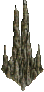 | 2272 (0x08E0) | 0, 0, 0 | 3 |
| 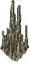 | 2273 (0x08E1) | 0, 0, 0 | 3 |
| 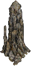 | 2274 (0x08E2) | 0, 0, 0 | 0 |
| 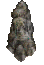 | 2275 (0x08E3) | 0, 0, 0 | 3 |
| 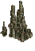 | 2276 (0x08E4) | 0, 0, 0 | 3 |
| 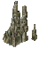 | 2277 (0x08E5) | 0, 0, 0 | 3 |
| 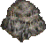 | 2278 (0x08E6) | 0, 0, 0 | 3 |
| 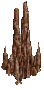 | 2279 (0x08E7) | 0, 0, 0 | 3 |
| 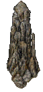 | 2280 (0x08E8) | 0, 0, 0 | 0 |
| 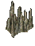 | 2281 (0x08E9) | 0, 0, 0 | 3 |
| 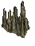 | 2282 (0x08EA) | 0, 0, 0 | 3 |
