# Forest Yew

_Generated on 2024-12-13 11:26:34_

## Peach Tree with green leaves

| Item | ID (Hex) | X, Y, Z | Frequency |
|:----:|:--------:|:-------:|:---------:|
|  | 3484 (0x0D9C) | 0, 0, 0 | 0 |
|  | 3485 (0x0D9D) | 0, 0, 0 | 0 |
|  | 3488 (0x0DA0) | 0, 0, 0 | 0 |
|  | 3489 (0x0DA1) | 0, 0, 0 | 0 |

## Peach Tree with green leaves and peaches

| Item | ID (Hex) | X, Y, Z | Frequency |
|:----:|:--------:|:-------:|:---------:|
|  | 3484 (0x0D9C) | 0, 0, 0 | 10 |
|  | 3486 (0x0D9E) | 0, 0, 0 | 10 |
|  | 3488 (0x0DA0) | 0, 0, 0 | 10 |
|  | 3490 (0x0DA2) | 0, 0, 0 | 10 |

## Peach Tree with brown leaves

| Item | ID (Hex) | X, Y, Z | Frequency |
|:----:|:--------:|:-------:|:---------:|
|  | 3484 (0x0D9C) | 0, 0, 0 | 0 |
|  | 3487 (0x0D9F) | 0, 0, 0 | 0 |
|  | 3488 (0x0DA0) | 0, 0, 0 | 0 |
|  | 3491 (0x0DA3) | 0, 0, 0 | 0 |

## Pear Tree with green leaves

| Item | ID (Hex) | X, Y, Z | Frequency |
|:----:|:--------:|:-------:|:---------:|
|  | 3492 (0x0DA4) | 0, 0, 0 | 0 |
|  | 3493 (0x0DA5) | 0, 0, 0 | 0 |
|  | 3496 (0x0DA8) | 0, 0, 0 | 0 |
|  | 3497 (0x0DA9) | 0, 0, 0 | 0 |

## Pear Tree with green leaves and pears

| Item | ID (Hex) | X, Y, Z | Frequency |
|:----:|:--------:|:-------:|:---------:|
|  | 3492 (0x0DA4) | 0, 0, 0 | 10 |
|  | 3494 (0x0DA6) | 0, 0, 0 | 10 |
|  | 3496 (0x0DA8) | 0, 0, 0 | 10 |
|  | 3498 (0x0DAA) | 0, 0, 0 | 10 |

## Pear Tree with brown leaves

| Item | ID (Hex) | X, Y, Z | Frequency |
|:----:|:--------:|:-------:|:---------:|
|  | 3492 (0x0DA4) | 0, 0, 0 | 0 |
| 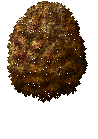 | 3495 (0x0DA7) | 0, 0, 0 | 0 |
|  | 3496 (0x0DA8) | 0, 0, 0 | 0 |
|  | 3499 (0x0DAB) | 0, 0, 0 | 0 |

## Tree grey, green leaves

| Item | ID (Hex) | X, Y, Z | Frequency |
|:----:|:--------:|:-------:|:---------:|
|  | 3277 (0x0CCD) | 0, 0, 0 | 8 |
|  | 3278 (0x0CCE) | 0, 0, 0 | 8 |
|  | 3283 (0x0CD3) | 0, 0, 0 | 8 |
| 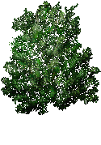 | 3284 (0x0CD4) | 0, 0, 0 | 8 |
|  | 3283 (0x0CD3) | 0, 0, 0 | 8 |
|  | 3284 (0x0CD4) | 0, 0, 0 | 8 |

## Tree grey, brown leaves

| Item | ID (Hex) | X, Y, Z | Frequency |
|:----:|:--------:|:-------:|:---------:|
|  | 3277 (0x0CCD) | 0, 0, 0 | 0 |
|  | 3279 (0x0CCF) | 0, 0, 0 | 0 |
|  | 3283 (0x0CD3) | 0, 0, 0 | 0 |
|  | 3285 (0x0CD5) | 0, 0, 0 | 0 |
|  | 3283 (0x0CD3) | 0, 0, 0 | 0 |
|  | 3285 (0x0CD5) | 0, 0, 0 | 0 |

## Tree, warm brown, green leaves

| Item | ID (Hex) | X, Y, Z | Frequency |
|:----:|:--------:|:-------:|:---------:|
|  | 3280 (0x0CD0) | 0, 0, 0 | 8 |
|  | 3281 (0x0CD1) | 0, 0, 0 | 8 |

## Tree, warm brown, brown leaves

| Item | ID (Hex) | X, Y, Z | Frequency |
|:----:|:--------:|:-------:|:---------:|
|  | 3280 (0x0CD0) | 0, 0, 0 | 0 |
|  | 3282 (0x0CD2) | 0, 0, 0 | 0 |

## Cedar tree

| Item | ID (Hex) | X, Y, Z | Frequency |
|:----:|:--------:|:-------:|:---------:|
|  | 3286 (0x0CD6) | 0, 0, 0 | 32 |
|  | 3287 (0x0CD7) | 0, 0, 0 | 32 |
|  | 3288 (0x0CD8) | 0, 0, 0 | 32 |
|  | 3289 (0x0CD9) | 0, 0, 0 | 32 |

## Oak tree, green leaves

| Item | ID (Hex) | X, Y, Z | Frequency |
|:----:|:--------:|:-------:|:---------:|
|  | 3290 (0x0CDA) | 0, 0, 0 | 32 |
|  | 3291 (0x0CDB) | 0, 0, 0 | 32 |
| 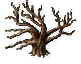 | 3293 (0x0CDD) | 0, 0, 0 | 32 |
|  | 3294 (0x0CDE) | 0, 0, 0 | 32 |

## Oak tree brown leaves

| Item | ID (Hex) | X, Y, Z | Frequency |
|:----:|:--------:|:-------:|:---------:|
|  | 3290 (0x0CDA) | 0, 0, 0 | 0 |
|  | 3292 (0x0CDC) | 0, 0, 0 | 0 |

## Oak tree, brown leaves

| Item | ID (Hex) | X, Y, Z | Frequency |
|:----:|:--------:|:-------:|:---------:|
|  | 3293 (0x0CDD) | 0, 0, 0 | 0 |
|  | 3295 (0x0CDF) | 0, 0, 0 | 0 |

## Walnut tree, green leaves

| Item | ID (Hex) | X, Y, Z | Frequency |
|:----:|:--------:|:-------:|:---------:|
|  | 3296 (0x0CE0) | 0, 0, 0 | 32 |
|  | 3297 (0x0CE1) | 0, 0, 0 | 32 |
| 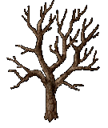 | 3299 (0x0CE3) | 0, 0, 0 | 32 |
|  | 3300 (0x0CE4) | 0, 0, 0 | 32 |

## Walnut tree, brown leaves

| Item | ID (Hex) | X, Y, Z | Frequency |
|:----:|:--------:|:-------:|:---------:|
|  | 3296 (0x0CE0) | 0, 0, 0 | 0 |
|  | 3298 (0x0CE2) | 0, 0, 0 | 0 |
|  | 3299 (0x0CE3) | 0, 0, 0 | 0 |
|  | 3301 (0x0CE5) | 0, 0, 0 | 0 |

## Willow tree, green leaves

| Item | ID (Hex) | X, Y, Z | Frequency |
|:----:|:--------:|:-------:|:---------:|
|  | 3302 (0x0CE6) | 0, 0, 0 | 32 |
| 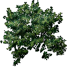 | 3303 (0x0CE7) | 0, 0, 0 | 32 |

## Willow tree, brown leaves

| Item | ID (Hex) | X, Y, Z | Frequency |
|:----:|:--------:|:-------:|:---------:|
|  | 3302 (0x0CE6) | 0, 0, 0 | 0 |
|  | 3304 (0x0CE8) | 0, 0, 0 | 0 |

## O'hii Tree

| Item | ID (Hex) | X, Y, Z | Frequency |
|:----:|:--------:|:-------:|:---------:|
|  | 3230 (0x0C9E) | 0, 0, 0 | 32 |

## Tree, dark brown

| Item | ID (Hex) | X, Y, Z | Frequency |
|:----:|:--------:|:-------:|:---------:|
|  | 3275 (0x0CCB) | 0, 0, 0 | 0 |

## Sapling

| Item | ID (Hex) | X, Y, Z | Frequency |
|:----:|:--------:|:-------:|:---------:|
|  | 3305 (0x0CE9) | 0, 0, 0 | 8 |
|  | 3305 (0x0CE9) | 0, 0, 0 | 8 |

## Apple tree, green leaves

| Item | ID (Hex) | X, Y, Z | Frequency |
|:----:|:--------:|:-------:|:---------:|
|  | 3476 (0x0D94) | 0, 0, 0 | 0 |
| 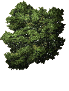 | 3477 (0x0D95) | 0, 0, 0 | 0 |
|  | 3480 (0x0D98) | 0, 0, 0 | 0 |
|  | 3481 (0x0D99) | 0, 0, 0 | 0 |

## Apple tree, green leaves, apples

| Item | ID (Hex) | X, Y, Z | Frequency |
|:----:|:--------:|:-------:|:---------:|
|  | 3476 (0x0D94) | 0, 0, 0 | 10 |
|  | 3478 (0x0D96) | 0, 0, 0 | 10 |
|  | 3480 (0x0D98) | 0, 0, 0 | 10 |
|  | 3482 (0x0D9A) | 0, 0, 0 | 10 |

## Apple tree, brown leaves

| Item | ID (Hex) | X, Y, Z | Frequency |
|:----:|:--------:|:-------:|:---------:|
|  | 3476 (0x0D94) | 0, 0, 0 | 0 |
|  | 3479 (0x0D97) | 0, 0, 0 | 0 |
|  | 3480 (0x0D98) | 0, 0, 0 | 0 |
|  | 3483 (0x0D9B) | 0, 0, 0 | 0 |

## Tree stump

| Item | ID (Hex) | X, Y, Z | Frequency |
|:----:|:--------:|:-------:|:---------:|
|  | 3673 (0x0E59) | 0, 0, 0 | 0 |

## Mushrooms

| Item | ID (Hex) | X, Y, Z | Frequency |
|:----:|:--------:|:-------:|:---------:|
|  | 3340 (0x0D0C) | 0, 0, 0 | 4 |
|  | 3341 (0x0D0D) | 0, 0, 0 | 4 |
|  | 3342 (0x0D0E) | 0, 0, 0 | 4 |
|  | 3343 (0x0D0F) | 0, 0, 0 | 4 |
|  | 3344 (0x0D10) | 0, 0, 0 | 4 |
|  | 3345 (0x0D11) | 0, 0, 0 | 4 |
| 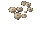 | 3346 (0x0D12) | 0, 0, 0 | 4 |
|  | 3347 (0x0D13) | 0, 0, 0 | 4 |
| 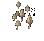 | 3348 (0x0D14) | 0, 0, 0 | 4 |
|  | 3349 (0x0D15) | 0, 0, 0 | 4 |
|  | 3350 (0x0D16) | 0, 0, 0 | 4 |
|  | 3351 (0x0D17) | 0, 0, 0 | 4 |
|  | 3352 (0x0D18) | 0, 0, 0 | 4 |
|  | 3353 (0x0D19) | 0, 0, 0 | 4 |

## Rocks

| Item | ID (Hex) | X, Y, Z | Frequency |
|:----:|:--------:|:-------:|:---------:|
|  | 4962 (0x1362) | 0, 0, 0 | 0 |
| 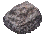 | 4963 (0x1363) | 0, 0, 0 | 0 |
|  | 4964 (0x1364) | 0, 0, 0 | 0 |
|  | 4965 (0x1365) | 0, 0, 0 | 0 |
|  | 4966 (0x1366) | 0, 0, 0 | 0 |
| 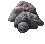 | 4967 (0x1367) | 0, 0, 0 | 0 |
| 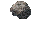 | 4968 (0x1368) | 0, 0, 0 | 0 |
|  | 4969 (0x1369) | 0, 0, 0 | 0 |
| 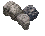 | 4970 (0x136A) | 0, 0, 0 | 0 |
|  | 4971 (0x136B) | 0, 0, 0 | 0 |
|  | 4972 (0x136C) | 0, 0, 0 | 0 |
|  | 4973 (0x136D) | 0, 0, 0 | 0 |
|  | 6001 (0x1771) | 0, 0, 0 | 0 |
|  | 6002 (0x1772) | 0, 0, 0 | 0 |
|  | 6003 (0x1773) | 0, 0, 0 | 2 |
|  | 6004 (0x1774) | 0, 0, 0 | 4 |
|  | 6005 (0x1775) | 0, 0, 0 | 0 |
|  | 6006 (0x1776) | 0, 0, 0 | 0 |
|  | 6007 (0x1777) | 0, 0, 0 | 2 |
|  | 6008 (0x1778) | 0, 0, 0 | 4 |
| 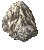 | 6009 (0x1779) | 0, 0, 0 | 0 |
|  | 6010 (0x177A) | 0, 0, 0 | 0 |
|  | 6011 (0x177B) | 0, 0, 0 | 2 |
|  | 6012 (0x177C) | 0, 0, 0 | 4 |

## Grasses

| Item | ID (Hex) | X, Y, Z | Frequency |
|:----:|:--------:|:-------:|:---------:|
|  | 3244 (0x0CAC) | 0, 0, 0 | 0 |
|  | 3245 (0x0CAD) | 0, 0, 0 | 0 |
|  | 3246 (0x0CAE) | 0, 0, 0 | 0 |
|  | 3247 (0x0CAF) | 0, 0, 0 | 0 |
|  | 3248 (0x0CB0) | 0, 0, 0 | 0 |
| 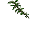 | 3249 (0x0CB1) | 0, 0, 0 | 0 |
|  | 3250 (0x0CB2) | 0, 0, 0 | 0 |
|  | 3251 (0x0CB3) | 0, 0, 0 | 0 |
|  | 3252 (0x0CB4) | 0, 0, 0 | 0 |
|  | 3253 (0x0CB5) | 0, 0, 0 | 0 |
|  | 3254 (0x0CB6) | 0, 0, 0 | 0 |
|  | 3255 (0x0CB7) | 0, 0, 0 | 0 |
|  | 3256 (0x0CB8) | 0, 0, 0 | 0 |
|  | 3257 (0x0CB9) | 0, 0, 0 | 0 |
|  | 3258 (0x0CBA) | 0, 0, 0 | 0 |
|  | 3259 (0x0CBB) | 0, 0, 0 | 0 |
|  | 3260 (0x0CBC) | 0, 0, 0 | 0 |
|  | 3261 (0x0CBD) | 0, 0, 0 | 0 |

## Weed

| Item | ID (Hex) | X, Y, Z | Frequency |
|:----:|:--------:|:-------:|:---------:|
|  | 3271 (0x0CC7) | 0, 0, 0 | 1 |

## Fan plant

| Item | ID (Hex) | X, Y, Z | Frequency |
|:----:|:--------:|:-------:|:---------:|
|  | 3224 (0x0C98) | 0, 0, 0 | 0 |

## Fern

| Item | ID (Hex) | X, Y, Z | Frequency |
|:----:|:--------:|:-------:|:---------:|
|  | 3224 (0x0C98) | 0, 0, 0 | 0 |
|  | 3231 (0x0C9F) | 0, 0, 0 | 0 |
|  | 3232 (0x0CA0) | 0, 0, 0 | 0 |
|  | 3234 (0x0CA2) | 0, 0, 0 | 0 |
|  | 3235 (0x0CA3) | 0, 0, 0 | 0 |
|  | 3236 (0x0CA4) | 0, 0, 0 | 0 |
|  | 3232 (0x0CA0) | 0, 0, 0 | 0 |

## Large Fern

| Item | ID (Hex) | X, Y, Z | Frequency |
|:----:|:--------:|:-------:|:---------:|
|  | 3233 (0x0CA1) | 0, 0, 0 | 0 |

## Bulrushes

| Item | ID (Hex) | X, Y, Z | Frequency |
|:----:|:--------:|:-------:|:---------:|
|  | 3220 (0x0C94) | 0, 0, 0 | 0 |

## Elephant ear plant

| Item | ID (Hex) | X, Y, Z | Frequency |
|:----:|:--------:|:-------:|:---------:|
|  | 3223 (0x0C97) | 0, 0, 0 | 0 |

## Pampas Gras

| Item | ID (Hex) | X, Y, Z | Frequency |
|:----:|:--------:|:-------:|:---------:|
|  | 3237 (0x0CA5) | 0, 0, 0 | 0 |

## Rushes

| Item | ID (Hex) | X, Y, Z | Frequency |
|:----:|:--------:|:-------:|:---------:|
|  | 3239 (0x0CA7) | 0, 0, 0 | 0 |

## Snake plant

| Item | ID (Hex) | X, Y, Z | Frequency |
|:----:|:--------:|:-------:|:---------:|
|  | 3241 (0x0CA9) | 0, 0, 0 | 0 |

## Sticks

| Item | ID (Hex) | X, Y, Z | Frequency |
|:----:|:--------:|:-------:|:---------:|
|  | 7067 (0x1B9B) | 0, 0, 0 | 2 |

## Twigs

| Item | ID (Hex) | X, Y, Z | Frequency |
|:----:|:--------:|:-------:|:---------:|
|  | 7068 (0x1B9C) | 0, 0, 0 | 4 |
|  | 7069 (0x1B9D) | 0, 0, 0 | 4 |
|  | 7070 (0x1B9E) | 0, 0, 0 | 0 |

## Fallen log N/S

| Item | ID (Hex) | X, Y, Z | Frequency |
|:----:|:--------:|:-------:|:---------:|
|  | 3315 (0x0CF3) | 0, 0, 0 | 8 |
|  | 3316 (0x0CF4) | 0, 1, 0 | 8 |

## Fallen log W/E

| Item | ID (Hex) | X, Y, Z | Frequency |
|:----:|:--------:|:-------:|:---------:|
|  | 3317 (0x0CF5) | -1, 0, 0 | 8 |
|  | 3318 (0x0CF6) | 0, 0, 0 | 8 |
|  | 3319 (0x0CF7) | 1, 0, 0 | 8 |

## Foxglove flower

| Item | ID (Hex) | X, Y, Z | Frequency |
|:----:|:--------:|:-------:|:---------:|
| 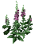 | 3204 (0x0C84) | 0, 0, 0 | 2 |
| 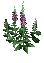 | 3210 (0x0C8A) | 0, 0, 0 | 2 |

## Ourflour flower

| Item | ID (Hex) | X, Y, Z | Frequency |
|:----:|:--------:|:-------:|:---------:|
| 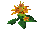 | 3205 (0x0C85) | 0, 0, 0 | 2 |

## Campion flowers

| Item | ID (Hex) | X, Y, Z | Frequency |
|:----:|:--------:|:-------:|:---------:|
| 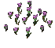 | 3207 (0x0C87) | 0, 0, 0 | 2 |

## Snowdrops

| Item | ID (Hex) | X, Y, Z | Frequency |
|:----:|:--------:|:-------:|:---------:|
| 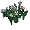 | 3208 (0x0C88) | 0, 0, 0 | 2 |

## Poppies

| Item | ID (Hex) | X, Y, Z | Frequency |
|:----:|:--------:|:-------:|:---------:|
|  | 3262 (0x0CBE) | 0, 0, 0 | 2 |
| 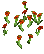 | 3263 (0x0CBF) | 0, 0, 0 | 2 |

## White flowers

| Item | ID (Hex) | X, Y, Z | Frequency |
|:----:|:--------:|:-------:|:---------:|
|  | 3211 (0x0C8B) | 0, 0, 0 | 2 |
|  | 3212 (0x0C8C) | 0, 0, 0 | 2 |

## Flowers

| Item | ID (Hex) | X, Y, Z | Frequency |
|:----:|:--------:|:-------:|:---------:|
|  | 3127 (0x0C37) | 0, 0, 0 | 4 |
|  | 3128 (0x0C38) | 0, 0, 0 | 4 |
|  | 3141 (0x0C45) | 0, 0, 0 | 4 |
|  | 3142 (0x0C46) | 0, 0, 0 | 4 |
| 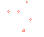 | 3143 (0x0C47) | 0, 0, 0 | 4 |
|  | 3144 (0x0C48) | 0, 0, 0 | 0 |
|  | 3145 (0x0C49) | 0, 0, 0 | 4 |
| 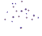 | 3146 (0x0C4A) | 0, 0, 0 | 0 |
|  | 3147 (0x0C4B) | 0, 0, 0 | 4 |
|  | 3148 (0x0C4C) | 0, 0, 0 | 0 |
|  | 3149 (0x0C4D) | 0, 0, 0 | 0 |
|  | 3150 (0x0C4E) | 0, 0, 0 | 4 |

## Brambles

| Item | ID (Hex) | X, Y, Z | Frequency |
|:----:|:--------:|:-------:|:---------:|
|  | 3391 (0x0D3F) | 0, 0, 0 | 0 |
|  | 3392 (0x0D40) | 0, 0, 0 | 0 |

## Yew Tree

| Item | ID (Hex) | X, Y, Z | Frequency |
|:----:|:--------:|:-------:|:---------:|
|  | 4797 (0x12BD) | 4, -4, 0 | 3 |
|  | 4796 (0x12BC) | 3, -3, 0 | 3 |
|  | 4795 (0x12BB) | 2, -2, 0 | 3 |
|  | 4794 (0x12BA) | 1, -1, 0 | 3 |
|  | 4793 (0x12B9) | 0, 0, 0 | 3 |
|  | 4792 (0x12B8) | -1, 1, 0 | 3 |
|  | 4791 (0x12B7) | -2, 2, 0 | 3 |
|  | 4790 (0x12B6) | -3, 3, 0 | 3 |
|  | 4798 (0x12BE) | -4, 4, 0 | 3 |
|  | 4799 (0x12BF) | -3, 3, 0 | 3 |
|  | 4800 (0x12C0) | -2, 2, 0 | 3 |
|  | 4801 (0x12C1) | -1, 1, 0 | 3 |
|  | 4802 (0x12C2) | 0, 0, 0 | 3 |
|  | 4803 (0x12C3) | 1, -1, 0 | 3 |
|  | 4804 (0x12C4) | 2, -2, 0 | 3 |
|  | 4805 (0x12C5) | 3, -3, 0 | 3 |
|  | 4806 (0x12C6) | 4, -4, 0 | 3 |
|  | 4807 (0x12C7) | 5, -5, 0 | 3 |

## Mushroom Ring

| Item | ID (Hex) | X, Y, Z | Frequency |
|:----:|:--------:|:-------:|:---------:|
|  | 3343 (0x0D0F) | 2, 0, 0 | 4 |
|  | 3344 (0x0D10) | 1, 1, 0 | 4 |
|  | 3342 (0x0D0E) | 3, 1, 0 | 4 |
|  | 3345 (0x0D11) | 0, 2, 0 | 4 |
|  | 3341 (0x0D0D) | 2, 2, 0 | 4 |
|  | 3340 (0x0D0C) | 1, 3, 0 | 4 |
