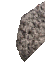
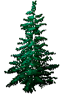
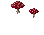
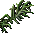

# Goblin Forest Vyseky

_Generated on 2024-12-13 11:26:34_

## Kamen velky

| Item | ID (Hex) | X, Y, Z | Frequency |
|:----:|:--------:|:-------:|:---------:|
|  | 4944 (0x1350) | 0, 0, 0 | 0 |
|  | 4943 (0x134F) | -1, 0, 0 | 0 |
|  | 4945 (0x1351) | 0, -1, 0 | 0 |

## Kamen velky 3

| Item | ID (Hex) | X, Y, Z | Frequency |
|:----:|:--------:|:-------:|:---------:|
|  | 4949 (0x1355) | 0, 1, 0 | 0 |
|  | 4950 (0x1356) | 0, 0, 0 | 0 |
|  | 4957 (0x135D) | 0, 0, 0 | 0 |
|  | 4956 (0x135C) | -1, 0, 0 | 0 |
|  | 4958 (0x135E) | 0, -1, 0 | 0 |

## Kamen velky 4

| Item | ID (Hex) | X, Y, Z | Frequency |
|:----:|:--------:|:-------:|:---------:|
|  | 4957 (0x135D) | 0, 0, 0 | 0 |
|  | 4956 (0x135C) | -1, 0, 0 | 0 |
|  | 4958 (0x135E) | 0, -1, 0 | 0 |

## kamen

| Item | ID (Hex) | X, Y, Z | Frequency |
|:----:|:--------:|:-------:|:---------:|
|  | 4963 (0x1363) | 0, -1, 0 | 0 |
|  | 4963 (0x1363) | 0, -1, 0 | 0 |

## kamen2

| Item | ID (Hex) | X, Y, Z | Frequency |
|:----:|:--------:|:-------:|:---------:|
|  | 4966 (0x1366) | 0, -1, 0 | 0 |
|  | 4966 (0x1366) | 0, -1, 0 | 0 |

## kamen3

| Item | ID (Hex) | X, Y, Z | Frequency |
|:----:|:--------:|:-------:|:---------:|
|  | 4964 (0x1364) | 0, -1, 0 | 0 |
|  | 4964 (0x1364) | 0, -1, 0 | 4 |

## vyseky

| Item | ID (Hex) | X, Y, Z | Frequency |
|:----:|:--------:|:-------:|:---------:|
|  | 3671 (0x0E57) | 0, 0, 0 | 30 |
|  | 4152 (0x1038) | 1, 0, 0 | 30 |

## vyseky2

| Item | ID (Hex) | X, Y, Z | Frequency |
|:----:|:--------:|:-------:|:---------:|
|  | 3673 (0x0E59) | 0, 0, 0 | 30 |
|  | 4152 (0x1038) | 0, -1, 0 | 30 |
|  | 7069 (0x1B9D) | -1, 1, 0 | 30 |

## vyseky3

| Item | ID (Hex) | X, Y, Z | Frequency |
|:----:|:--------:|:-------:|:---------:|
|  | 3671 (0x0E57) | 0, 0, 0 | 30 |
|  | 4152 (0x1038) | 1, 0, 0 | 30 |
|  | 7069 (0x1B9D) | 0, 1, 0 | 30 |

## vyseky4

| Item | ID (Hex) | X, Y, Z | Frequency |
|:----:|:--------:|:-------:|:---------:|
|  | 3671 (0x0E57) | 1, 0, 0 | 30 |
|  | 4152 (0x1038) | 2, 0, 0 | 30 |

## vyseky5

| Item | ID (Hex) | X, Y, Z | Frequency |
|:----:|:--------:|:-------:|:---------:|
|  | 3673 (0x0E59) | 1, 0, 0 | 0 |
|  | 4152 (0x1038) | 1, 1, 0 | 0 |
|  | 7069 (0x1B9D) | 0, -1, 0 | 0 |

## Cedar tree

| Item | ID (Hex) | X, Y, Z | Frequency |
|:----:|:--------:|:-------:|:---------:|
|  | 3286 (0x0CD6) | 0, 0, 0 | 0 |
|  | 3287 (0x0CD7) | 0, 0, 0 | 0 |
|  | 3288 (0x0CD8) | 0, 0, 0 | 0 |
|  | 3289 (0x0CD9) | 0, 0, 0 | 0 |

## parez

| Item | ID (Hex) | X, Y, Z | Frequency |
|:----:|:--------:|:-------:|:---------:|
|  | 3673 (0x0E59) | 0, 0, 0 | 2 |

## kapradi

| Item | ID (Hex) | X, Y, Z | Frequency |
|:----:|:--------:|:-------:|:---------:|
|  | 3224 (0x0C98) | 0, 0, 0 | 5 |
|  | 3231 (0x0C9F) | 0, 0, 0 | 5 |
|  | 3232 (0x0CA0) | 0, 0, 0 | 5 |

## kapradi velke

| Item | ID (Hex) | X, Y, Z | Frequency |
|:----:|:--------:|:-------:|:---------:|
|  | 3233 (0x0CA1) | 0, 0, 0 | 0 |
|  | 3234 (0x0CA2) | 0, 0, 0 | 0 |
|  | 3235 (0x0CA3) | 0, 0, 0 | 0 |
|  | 3236 (0x0CA4) | 0, 0, 0 | 0 |

## klada

| Item | ID (Hex) | X, Y, Z | Frequency |
|:----:|:--------:|:-------:|:---------:|
|  | 3315 (0x0CF3) | 0, 0, 0 | 2 |
|  | 3316 (0x0CF4) | 0, 1, 0 | 2 |
|  | 3318 (0x0CF6) | 0, 0, 0 | 2 |
|  | 3317 (0x0CF5) | -1, 0, 0 | 2 |
|  | 3319 (0x0CF7) | 1, 0, 0 | 2 |

## kvetinka

| Item | ID (Hex) | X, Y, Z | Frequency |
|:----:|:--------:|:-------:|:---------:|
|  | 3205 (0x0C85) | 1, 0, 0 | 1 |

## kvetinky

| Item | ID (Hex) | X, Y, Z | Frequency |
|:----:|:--------:|:-------:|:---------:|
|  | 3206 (0x0C86) | 1, 0, 0 | 0 |
|  | 3207 (0x0C87) | 1, 0, 0 | 0 |

## bili

| Item | ID (Hex) | X, Y, Z | Frequency |
|:----:|:--------:|:-------:|:---------:|
|  | 3211 (0x0C8B) | 1, 0, 0 | 2 |

## koprivy

| Item | ID (Hex) | X, Y, Z | Frequency |
|:----:|:--------:|:-------:|:---------:|
|  | 3213 (0x0C8D) | 0, 0, 0 | 1 |

## Kamen velky 1

| Item | ID (Hex) | X, Y, Z | Frequency |
|:----:|:--------:|:-------:|:---------:|
|  | 4944 (0x1350) | 0, 0, 0 | 0 |
|  | 4943 (0x134F) | -1, 0, 0 | 0 |
|  | 4945 (0x1351) | 0, -1, 0 | 0 |

## Kamen velky 2

| Item | ID (Hex) | X, Y, Z | Frequency |
|:----:|:--------:|:-------:|:---------:|
|  | 4949 (0x1355) | 0, 1, 0 | 0 |
|  | 4950 (0x1356) | 0, 0, 0 | 0 |

## flowers

| Item | ID (Hex) | X, Y, Z | Frequency |
|:----:|:--------:|:-------:|:---------:|
|  | 3148 (0x0C4C) | 0, 0, 0 | 4 |

## flowers2

| Item | ID (Hex) | X, Y, Z | Frequency |
|:----:|:--------:|:-------:|:---------:|
|  | 3146 (0x0C4A) | 0, 0, 0 | 4 |

## houby

| Item | ID (Hex) | X, Y, Z | Frequency |
|:----:|:--------:|:-------:|:---------:|
|  | 3351 (0x0D17) | 0, 0, 0 | 4 |
|  | 3350 (0x0D16) | 1, 0, 0 | 5 |

## houby2

| Item | ID (Hex) | X, Y, Z | Frequency |
|:----:|:--------:|:-------:|:---------:|
|  | 3349 (0x0D15) | 0, 0, 0 | 4 |

## houby3

| Item | ID (Hex) | X, Y, Z | Frequency |
|:----:|:--------:|:-------:|:---------:|
|  | 3346 (0x0D12) | 0, 0, 0 | 4 |

## houby4

| Item | ID (Hex) | X, Y, Z | Frequency |
|:----:|:--------:|:-------:|:---------:|
|  | 3343 (0x0D0F) | 0, 0, 0 | 4 |

## flowers 3 

| Item | ID (Hex) | X, Y, Z | Frequency |
|:----:|:--------:|:-------:|:---------:|
|  | 3142 (0x0C46) | 0, -1, 0 | 5 |

## kvetiny3

| Item | ID (Hex) | X, Y, Z | Frequency |
|:----:|:--------:|:-------:|:---------:|
|  | 3246 (0x0CAE) | 0, 0, 0 | 5 |

## kvetiny4

| Item | ID (Hex) | X, Y, Z | Frequency |
|:----:|:--------:|:-------:|:---------:|
|  | 3245 (0x0CAD) | 0, 0, 0 | 5 |

## kvetiny5

| Item | ID (Hex) | X, Y, Z | Frequency |
|:----:|:--------:|:-------:|:---------:|
|  | 3244 (0x0CAC) | 1, 0, 0 | 5 |

## kvetiny6

| Item | ID (Hex) | X, Y, Z | Frequency |
|:----:|:--------:|:-------:|:---------:|
|  | 3247 (0x0CAF) | 0, 0, 0 | 5 |

## kvetiny7

| Item | ID (Hex) | X, Y, Z | Frequency |
|:----:|:--------:|:-------:|:---------:|
|  | 3248 (0x0CB0) | 1, 0, 0 | 5 |

## kvetiny8

| Item | ID (Hex) | X, Y, Z | Frequency |
|:----:|:--------:|:-------:|:---------:|
|  | 3249 (0x0CB1) | 0, 0, 0 | 5 |

## kvetiny9

| Item | ID (Hex) | X, Y, Z | Frequency |
|:----:|:--------:|:-------:|:---------:|
|  | 3253 (0x0CB5) | 0, -1, 0 | 5 |

## kvetiny10

| Item | ID (Hex) | X, Y, Z | Frequency |
|:----:|:--------:|:-------:|:---------:|
|  | 3254 (0x0CB6) | 1, 0, 0 | 5 |
