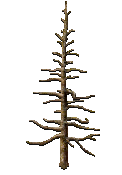
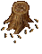
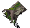
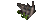
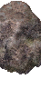
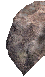
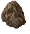
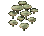
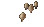

# Goblin Forest

_Generated on 2024-12-13 11:26:34_

## Cedar tree

| Item | ID (Hex) | X, Y, Z | Frequency |
|:----:|:--------:|:-------:|:---------:|
|  | 3286 (0x0CD6) | 0, 0, 0 | 100 |
|  | 3287 (0x0CD7) | 0, 0, 0 | 100 |
|  | 3288 (0x0CD8) | 0, 0, 0 | 100 |
|  | 3289 (0x0CD9) | 0, 0, 0 | 100 |
|  | 3286 (0x0CD6) | 0, 0, 0 | 100 |
|  | 3287 (0x0CD7) | 0, 0, 0 | 100 |
|  | 3288 (0x0CD8) | 0, 0, 0 | 100 |
|  | 3289 (0x0CD9) | 0, 0, 0 | 100 |

## parez

| Item | ID (Hex) | X, Y, Z | Frequency |
|:----:|:--------:|:-------:|:---------:|
|  | 3673 (0x0E59) | 0, 0, 0 | 0 |

## kapradi

| Item | ID (Hex) | X, Y, Z | Frequency |
|:----:|:--------:|:-------:|:---------:|
|  | 3224 (0x0C98) | 0, 0, 0 | 80 |
|  | 3231 (0x0C9F) | 0, 0, 0 | 80 |
|  | 3232 (0x0CA0) | 0, 0, 0 | 80 |

## kapradi velke

| Item | ID (Hex) | X, Y, Z | Frequency |
|:----:|:--------:|:-------:|:---------:|
|  | 3233 (0x0CA1) | 0, 0, 0 | 60 |
|  | 3234 (0x0CA2) | 0, 0, 0 | 50 |
|  | 3235 (0x0CA3) | 0, 0, 0 | 40 |
|  | 3236 (0x0CA4) | 0, 0, 0 | 40 |

## klada

| Item | ID (Hex) | X, Y, Z | Frequency |
|:----:|:--------:|:-------:|:---------:|
|  | 3315 (0x0CF3) | 0, 0, 0 | 2 |
|  | 3316 (0x0CF4) | 0, 1, 0 | 2 |
|  | 3318 (0x0CF6) | 0, 0, 0 | 2 |
|  | 3317 (0x0CF5) | -1, 0, 0 | 2 |
|  | 3319 (0x0CF7) | 1, 0, 0 | 2 |

## kvetinka

| Item | ID (Hex) | X, Y, Z | Frequency |
|:----:|:--------:|:-------:|:---------:|
|  | 3205 (0x0C85) | 1, 0, 0 | 2 |

## kvetinky

| Item | ID (Hex) | X, Y, Z | Frequency |
|:----:|:--------:|:-------:|:---------:|
|  | 3206 (0x0C86) | 1, 0, 0 | 0 |
|  | 3207 (0x0C87) | 1, 0, 0 | 0 |

## Kamen velky

| Item | ID (Hex) | X, Y, Z | Frequency |
|:----:|:--------:|:-------:|:---------:|
|  | 4944 (0x1350) | 2, 0, 0 | 1 |
|  | 4943 (0x134F) | 1, 0, 0 | 1 |
|  | 4945 (0x1351) | 2, -1, 0 | 1 |

## Kamen velky 3

| Item | ID (Hex) | X, Y, Z | Frequency |
|:----:|:--------:|:-------:|:---------:|
|  | 4949 (0x1355) | 0, -2, 0 | 1 |
|  | 4950 (0x1356) | 0, -3, 0 | 1 |

## kamen

| Item | ID (Hex) | X, Y, Z | Frequency |
|:----:|:--------:|:-------:|:---------:|
|  | 4963 (0x1363) | 0, -1, 0 | 5 |

## kamen2

| Item | ID (Hex) | X, Y, Z | Frequency |
|:----:|:--------:|:-------:|:---------:|
|  | 4966 (0x1366) | 0, -1, 0 | 5 |

## kamen3

| Item | ID (Hex) | X, Y, Z | Frequency |
|:----:|:--------:|:-------:|:---------:|
|  | 4964 (0x1364) | 0, -1, 0 | 5 |

## kamen4

| Item | ID (Hex) | X, Y, Z | Frequency |
|:----:|:--------:|:-------:|:---------:|
|  | 6004 (0x1774) | 0, 0, 0 | 8 |

## kamen5

| Item | ID (Hex) | X, Y, Z | Frequency |
|:----:|:--------:|:-------:|:---------:|
|  | 6012 (0x177C) | 0, 0, 0 | 8 |

## kamen6

| Item | ID (Hex) | X, Y, Z | Frequency |
|:----:|:--------:|:-------:|:---------:|
|  | 6002 (0x1772) | 0, 0, 0 | 8 |

## kamen7

| Item | ID (Hex) | X, Y, Z | Frequency |
|:----:|:--------:|:-------:|:---------:|
|  | 6005 (0x1775) | 0, 0, 0 | 8 |

## kamen8

| Item | ID (Hex) | X, Y, Z | Frequency |
|:----:|:--------:|:-------:|:---------:|
|  | 6010 (0x177A) | 0, 0, 0 | 8 |

## kamen9

| Item | ID (Hex) | X, Y, Z | Frequency |
|:----:|:--------:|:-------:|:---------:|
|  | 6006 (0x1776) | 0, 0, 0 | 8 |

## kamen10

| Item | ID (Hex) | X, Y, Z | Frequency |
|:----:|:--------:|:-------:|:---------:|
|  | 6001 (0x1771) | 0, 0, 0 | 8 |

## kamen11

| Item | ID (Hex) | X, Y, Z | Frequency |
|:----:|:--------:|:-------:|:---------:|
|  | 6009 (0x1779) | 0, 0, 0 | 8 |

## kamen12

| Item | ID (Hex) | X, Y, Z | Frequency |
|:----:|:--------:|:-------:|:---------:|
|  | 6008 (0x1778) | 0, 0, 0 | 8 |

## kamen13

| Item | ID (Hex) | X, Y, Z | Frequency |
|:----:|:--------:|:-------:|:---------:|
|  | 6003 (0x1773) | 0, 0, 0 | 8 |

## kamen14

| Item | ID (Hex) | X, Y, Z | Frequency |
|:----:|:--------:|:-------:|:---------:|
|  | 6007 (0x1777) | 0, 0, 0 | 8 |

## kamen15

| Item | ID (Hex) | X, Y, Z | Frequency |
|:----:|:--------:|:-------:|:---------:|
|  | 6011 (0x177B) | 0, 0, 0 | 8 |

## lesni kvetiny1

| Item | ID (Hex) | X, Y, Z | Frequency |
|:----:|:--------:|:-------:|:---------:|
|  | 3332 (0x0D04) | 0, 0, 0 | 20 |

## lesni kvetiny2

| Item | ID (Hex) | X, Y, Z | Frequency |
|:----:|:--------:|:-------:|:---------:|
|  | 3348 (0x0D14) | 0, 0, 0 | 3 |

## lesni kvetiny3

| Item | ID (Hex) | X, Y, Z | Frequency |
|:----:|:--------:|:-------:|:---------:|
|  | 3204 (0x0C84) | 0, 0, 0 | 20 |

## lesni kvetiny4

| Item | ID (Hex) | X, Y, Z | Frequency |
|:----:|:--------:|:-------:|:---------:|
|  | 3223 (0x0C97) | 0, 0, 0 | 20 |

## lesni kvetiny5

| Item | ID (Hex) | X, Y, Z | Frequency |
|:----:|:--------:|:-------:|:---------:|
|  | 3248 (0x0CB0) | 0, 0, 0 | 20 |

## houby1

| Item | ID (Hex) | X, Y, Z | Frequency |
|:----:|:--------:|:-------:|:---------:|
|  | 3349 (0x0D15) | 0, 0, 0 | 6 |

## houby2

| Item | ID (Hex) | X, Y, Z | Frequency |
|:----:|:--------:|:-------:|:---------:|
|  | 3342 (0x0D0E) | 0, 0, 0 | 6 |

## houby3

| Item | ID (Hex) | X, Y, Z | Frequency |
|:----:|:--------:|:-------:|:---------:|
|  | 3347 (0x0D13) | 0, 0, 0 | 6 |

## flovers

| Item | ID (Hex) | X, Y, Z | Frequency |
|:----:|:--------:|:-------:|:---------:|
|  | 3149 (0x0C4D) | 0, 0, 0 | 5 |

## flovers1

| Item | ID (Hex) | X, Y, Z | Frequency |
|:----:|:--------:|:-------:|:---------:|
|  | 3212 (0x0C8C) | 0, 0, 0 | 5 |

## flovers2

| Item | ID (Hex) | X, Y, Z | Frequency |
|:----:|:--------:|:-------:|:---------:|
|  | 3210 (0x0C8A) | 0, 0, 0 | 5 |

## flovers3

| Item | ID (Hex) | X, Y, Z | Frequency |
|:----:|:--------:|:-------:|:---------:|
|  | 3254 (0x0CB6) | 0, 0, 0 | 5 |

## flovers4

| Item | ID (Hex) | X, Y, Z | Frequency |
|:----:|:--------:|:-------:|:---------:|
|  | 3253 (0x0CB5) | 0, 0, 0 | 5 |

## flovers5

| Item | ID (Hex) | X, Y, Z | Frequency |
|:----:|:--------:|:-------:|:---------:|
|  | 3214 (0x0C8E) | 1, 0, 0 | 5 |

## houby 4

| Item | ID (Hex) | X, Y, Z | Frequency |
|:----:|:--------:|:-------:|:---------:|
|  | 3341 (0x0D0D) | 1, 0, 0 | 5 |

## houby 5

| Item | ID (Hex) | X, Y, Z | Frequency |
|:----:|:--------:|:-------:|:---------:|
|  | 3345 (0x0D11) | 1, 0, 0 | 5 |

## houby6

| Item | ID (Hex) | X, Y, Z | Frequency |
|:----:|:--------:|:-------:|:---------:|
|  | 3351 (0x0D17) | 1, 0, 0 | 5 |

## flowers 2

| Item | ID (Hex) | X, Y, Z | Frequency |
|:----:|:--------:|:-------:|:---------:|
|  | 3371 (0x0D2B) | 1, 0, 0 | 5 |
