# Grass

_Generated on 2024-12-13 11:26:34_

## Tree grey, green leaves

| Item | ID (Hex) | X, Y, Z | Frequency |
|:----:|:--------:|:-------:|:---------:|
| 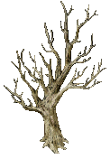 | 3277 (0x0CCD) | 0, 0, 0 | 1 |
| 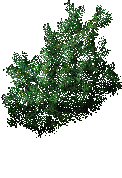 | 3278 (0x0CCE) | 0, 0, 0 | 1 |
| 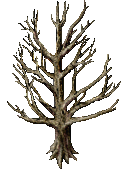 | 3283 (0x0CD3) | 0, 0, 0 | 1 |
| 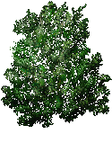 | 3284 (0x0CD4) | 0, 0, 0 | 1 |
|  | 3283 (0x0CD3) | 0, 0, 0 | 1 |
|  | 3284 (0x0CD4) | 0, 0, 0 | 1 |

## Tree, warm brown, green leaves

| Item | ID (Hex) | X, Y, Z | Frequency |
|:----:|:--------:|:-------:|:---------:|
|  | 3280 (0x0CD0) | 0, 0, 0 | 1 |
|  | 3281 (0x0CD1) | 0, 0, 0 | 1 |

## Oak tree, green leaves

| Item | ID (Hex) | X, Y, Z | Frequency |
|:----:|:--------:|:-------:|:---------:|
| 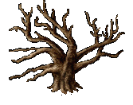 | 3293 (0x0CDD) | 0, 0, 0 | 1 |
|  | 3294 (0x0CDE) | 0, 0, 0 | 1 |

##  Walnut tree, green leaves

| Item | ID (Hex) | X, Y, Z | Frequency |
|:----:|:--------:|:-------:|:---------:|
| 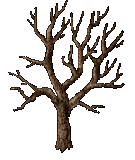 | 3299 (0x0CE3) | 0, 0, 0 | 1 |
| 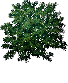 | 3300 (0x0CE4) | 0, 0, 0 | 1 |

## Willow tree, green leaves

| Item | ID (Hex) | X, Y, Z | Frequency |
|:----:|:--------:|:-------:|:---------:|
| 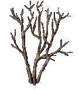 | 3302 (0x0CE6) | 0, 0, 0 | 1 |
| 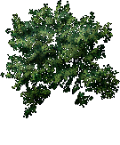 | 3303 (0x0CE7) | 0, 0, 0 | 1 |

## Foxglove flower

| Item | ID (Hex) | X, Y, Z | Frequency |
|:----:|:--------:|:-------:|:---------:|
|  | 3204 (0x0C84) | 0, 0, 0 | 5 |
|  | 3210 (0x0C8A) | 0, 0, 0 | 0 |

## Ourflour flower

| Item | ID (Hex) | X, Y, Z | Frequency |
|:----:|:--------:|:-------:|:---------:|
|  | 3205 (0x0C85) | 0, 0, 0 | 5 |

## Campion flowers

| Item | ID (Hex) | X, Y, Z | Frequency |
|:----:|:--------:|:-------:|:---------:|
|  | 3207 (0x0C87) | 0, 0, 0 | 5 |

## Snowdrops

| Item | ID (Hex) | X, Y, Z | Frequency |
|:----:|:--------:|:-------:|:---------:|
|  | 3208 (0x0C88) | 0, 0, 0 | 5 |

## White flowers

| Item | ID (Hex) | X, Y, Z | Frequency |
|:----:|:--------:|:-------:|:---------:|
|  | 3211 (0x0C8B) | 0, 0, 0 | 0 |
|  | 3212 (0x0C8C) | 0, 0, 0 | 10 |

## Poppies

| Item | ID (Hex) | X, Y, Z | Frequency |
|:----:|:--------:|:-------:|:---------:|
|  | 3262 (0x0CBE) | 0, 0, 0 | 0 |
|  | 3263 (0x0CBF) | 0, 0, 0 | 5 |

## Mushroom Ring

| Item | ID (Hex) | X, Y, Z | Frequency |
|:----:|:--------:|:-------:|:---------:|
|  | 3343 (0x0D0F) | 2, 0, 0 | 5 |
| 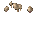 | 3344 (0x0D10) | 1, 1, 0 | 5 |
| 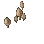 | 3342 (0x0D0E) | 3, 1, 0 | 5 |
| 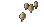 | 3345 (0x0D11) | 0, 2, 0 | 5 |
| 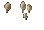 | 3341 (0x0D0D) | 2, 2, 0 | 5 |
| 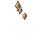 | 3340 (0x0D0C) | 1, 3, 0 | 5 |

## Mushrooms

| Item | ID (Hex) | X, Y, Z | Frequency |
|:----:|:--------:|:-------:|:---------:|
|  | 3346 (0x0D12) | 0, 0, 0 | 0 |
|  | 3347 (0x0D13) | 0, 0, 0 | 5 |
| 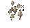 | 3348 (0x0D14) | 0, 0, 0 | 5 |
|  | 3349 (0x0D15) | 0, 0, 0 | 0 |
|  | 3350 (0x0D16) | 0, 0, 0 | 0 |
|  | 3351 (0x0D17) | 0, 0, 0 | 5 |
|  | 3352 (0x0D18) | 0, 0, 0 | 5 |
|  | 3353 (0x0D19) | 0, 0, 0 | 0 |

## Rocks

| Item | ID (Hex) | X, Y, Z | Frequency |
|:----:|:--------:|:-------:|:---------:|
|  | 6003 (0x1773) | 0, 0, 0 | 5 |
|  | 6004 (0x1774) | 0, 0, 0 | 5 |
| 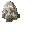 | 6011 (0x177B) | 0, 0, 0 | 5 |
| 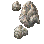 | 6012 (0x177C) | 0, 0, 0 | 5 |

## Flowers

| Item | ID (Hex) | X, Y, Z | Frequency |
|:----:|:--------:|:-------:|:---------:|
|  | 3127 (0x0C37) | 0, 0, 0 | 5 |
|  | 3128 (0x0C38) | 0, 0, 0 | 5 |
| 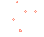 | 3141 (0x0C45) | 0, 0, 0 | 5 |
|  | 3142 (0x0C46) | 0, 0, 0 | 5 |
| 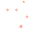 | 3143 (0x0C47) | 0, 0, 0 | 5 |
| 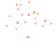 | 3144 (0x0C48) | 0, 0, 0 | 5 |
|  | 3145 (0x0C49) | 0, 0, 0 | 5 |
|  | 3146 (0x0C4A) | 0, 0, 0 | 5 |
|  | 3147 (0x0C4B) | 0, 0, 0 | 5 |
|  | 3148 (0x0C4C) | 0, 0, 0 | 5 |
|  | 3149 (0x0C4D) | 0, 0, 0 | 5 |
|  | 3150 (0x0C4E) | 0, 0, 0 | 5 |

## Grasses

| Item | ID (Hex) | X, Y, Z | Frequency |
|:----:|:--------:|:-------:|:---------:|
|  | 3248 (0x0CB0) | 0, 0, 0 | 10 |
|  | 3249 (0x0CB1) | 0, 0, 0 | 10 |
|  | 3250 (0x0CB2) | 0, 0, 0 | 10 |
|  | 3251 (0x0CB3) | 0, 0, 0 | 10 |
|  | 3253 (0x0CB5) | 0, 0, 0 | 10 |
|  | 3258 (0x0CBA) | 0, 0, 0 | 10 |
