# Jungle

_Generated on 2024-12-13 11:26:34_

## Jungle Tree 01 - Leaves 01a

| Item | ID (Hex) | X, Y, Z | Frequency |
|:----:|:--------:|:-------:|:---------:|
|  | 3393 (0x0D41) | -1, 1, 0 | 2 |
|  | 3394 (0x0D42) | 0, 0, 0 | 2 |
|  | 3395 (0x0D43) | 1, -1, 0 | 2 |
|  | 3396 (0x0D44) | 2, -2, 0 | 2 |
|  | 3397 (0x0D45) | -3, 3, 0 | 2 |
|  | 3398 (0x0D46) | -2, 2, 0 | 2 |
|  | 3399 (0x0D47) | -1, 1, 0 | 2 |
|  | 3400 (0x0D48) | 0, 0, 0 | 2 |
|  | 3401 (0x0D49) | 1, -1, 0 | 2 |
|  | 3402 (0x0D4A) | 2, -2, 0 | 2 |
|  | 3403 (0x0D4B) | 3, -3, 0 | 2 |
|  | 3404 (0x0D4C) | 4, -4, 0 | 2 |

## Jungle Tree 01 - Leaves 01b

| Item | ID (Hex) | X, Y, Z | Frequency |
|:----:|:--------:|:-------:|:---------:|
|  | 3393 (0x0D41) | -1, 1, 0 | 1 |
|  | 3394 (0x0D42) | 0, 0, 0 | 1 |
|  | 3395 (0x0D43) | 1, -1, 0 | 1 |
|  | 3396 (0x0D44) | 2, -2, 0 | 1 |
|  | 3405 (0x0D4D) | -2, 2, 0 | 1 |
|  | 3406 (0x0D4E) | -1, 1, 0 | 1 |
|  | 3407 (0x0D4F) | 0, 0, 0 | 1 |
|  | 3408 (0x0D50) | 1, -1, 0 | 1 |
|  | 3409 (0x0D51) | 2, -2, 0 | 1 |
|  | 3410 (0x0D52) | 3, -3, 0 | 1 |
|  | 3411 (0x0D53) | 4, -4, 0 | 1 |

## Jungle Tree 02 - Leaves 02a

| Item | ID (Hex) | X, Y, Z | Frequency |
|:----:|:--------:|:-------:|:---------:|
|  | 3415 (0x0D57) | -1, 1, 0 | 1 |
|  | 3416 (0x0D58) | -1, 1, 0 | 1 |
|  | 3417 (0x0D59) | 0, 0, 0 | 1 |
|  | 3418 (0x0D5A) | 1, -1, 0 | 1 |
|  | 3419 (0x0D5B) | 0, 0, 0 | 1 |
|  | 3420 (0x0D5C) | -3, 3, 0 | 1 |
|  | 3421 (0x0D5D) | -2, 2, 0 | 1 |
|  | 3422 (0x0D5E) | -1, 1, 0 | 1 |
|  | 3423 (0x0D5F) | 0, 0, 0 | 1 |
|  | 3424 (0x0D60) | 1, -1, 0 | 1 |
|  | 3425 (0x0D61) | 2, -2, 0 | 1 |
|  | 3426 (0x0D62) | 3, -3, 0 | 1 |

## Jungle Tree 02 - Leaves 02b

| Item | ID (Hex) | X, Y, Z | Frequency |
|:----:|:--------:|:-------:|:---------:|
|  | 3415 (0x0D57) | -2, 2, 0 | 2 |
|  | 3416 (0x0D58) | -1, 1, 0 | 2 |
|  | 3417 (0x0D59) | 0, 0, 0 | 2 |
|  | 3418 (0x0D5A) | 1, -1, 0 | 2 |
|  | 3419 (0x0D5B) | 2, -2, 0 | 2 |
|  | 3427 (0x0D63) | -3, 3, 0 | 2 |
|  | 3428 (0x0D64) | -2, 2, 0 | 2 |
|  | 3429 (0x0D65) | -1, 1, 0 | 2 |
|  | 3430 (0x0D66) | 0, 0, 0 | 2 |
|  | 3431 (0x0D67) | 1, -1, 0 | 2 |
|  | 3432 (0x0D68) | 2, -2, 0 | 2 |
|  | 3433 (0x0D69) | 3, -3, 0 | 2 |

## Jungle Tree 03 - Leaves 03a

| Item | ID (Hex) | X, Y, Z | Frequency |
|:----:|:--------:|:-------:|:---------:|
|  | 3438 (0x0D6E) | -2, 2, 0 | 2 |
|  | 3439 (0x0D6F) | -1, 1, 0 | 2 |
|  | 3440 (0x0D70) | 0, 0, 0 | 2 |
|  | 3441 (0x0D71) | 1, -1, 0 | 2 |
|  | 3442 (0x0D72) | 1, -1, 0 | 2 |
|  | 3443 (0x0D73) | -3, 3, 0 | 2 |
|  | 3444 (0x0D74) | -2, 2, 0 | 2 |
|  | 3445 (0x0D75) | -1, 1, 0 | 2 |
|  | 3446 (0x0D76) | 0, 0, 0 | 2 |
|  | 3447 (0x0D77) | 1, -1, 0 | 2 |
|  | 3448 (0x0D78) | 2, -2, 0 | 2 |
|  | 3449 (0x0D79) | 3, -3, 0 | 2 |

## Jungle Tree 04 - Leaves 04a

| Item | ID (Hex) | X, Y, Z | Frequency |
|:----:|:--------:|:-------:|:---------:|
|  | 3460 (0x0D84) | 0, 0, 0 | 1 |
|  | 3461 (0x0D85) | 0, 0, 0 | 1 |
|  | 3462 (0x0D86) | 1, -1, 0 | 1 |
|  | 3463 (0x0D87) | -2, 2, 0 | 1 |
|  | 3464 (0x0D88) | -1, 1, 0 | 1 |
|  | 3465 (0x0D89) | 0, 0, 0 | 1 |
|  | 3466 (0x0D8A) | 1, -1, 0 | 1 |
|  | 3467 (0x0D8B) | 2, -2, 0 | 1 |

##  Jungle Tree 04 - Leaves 04b

| Item | ID (Hex) | X, Y, Z | Frequency |
|:----:|:--------:|:-------:|:---------:|
|  | 3460 (0x0D84) | -1, 1, 0 | 2 |
|  | 3461 (0x0D85) | 0, 0, 0 | 2 |
|  | 3462 (0x0D86) | 1, -1, 0 | 2 |
|  | 3468 (0x0D8C) | -2, 2, 0 | 2 |
|  | 3469 (0x0D8D) | -1, 1, 0 | 2 |
|  | 3470 (0x0D8E) | 0, 0, 0 | 2 |
|  | 3471 (0x0D8F) | 1, -1, 0 | 2 |
|  | 3472 (0x0D90) | 2, -2, 0 | 2 |

## Water with Cattails

| Item | ID (Hex) | X, Y, Z | Frequency |
|:----:|:--------:|:-------:|:---------:|
|  | 6054 (0x17A6) | 0, 0, 0 | 0 |
|  | 6047 (0x179F) | 1, 0, 0 | 0 |
|  | 6053 (0x17A5) | 2, 0, 0 | 0 |
|  | 6052 (0x17A4) | 0, 1, 0 | 0 |
|  | 6039 (0x1797) | 1, 1, 0 | 0 |
|  | 6046 (0x179E) | 2, 1, 0 | 0 |
|  | 6056 (0x17A8) | 0, 2, 0 | 0 |
|  | 6049 (0x17A1) | 1, 2, 0 | 0 |
|  | 6055 (0x17A7) | 2, 2, 0 | 0 |
|  | 3256 (0x0CB8) | 0, 1, 0 | 0 |
| 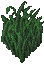 | 3259 (0x0CBB) | 0, 0, 0 | 0 |
|  | 3255 (0x0CB7) | 0, 1, 0 | 0 |

## Rocks

| Item | ID (Hex) | X, Y, Z | Frequency |
|:----:|:--------:|:-------:|:---------:|
|  | 4962 (0x1362) | 0, 0, 0 | 0 |
|  | 4963 (0x1363) | 0, 0, 0 | 0 |
|  | 4964 (0x1364) | 0, 0, 0 | 0 |
|  | 4965 (0x1365) | 0, 0, 0 | 0 |
|  | 4966 (0x1366) | 0, 0, 0 | 0 |
|  | 4967 (0x1367) | 0, 0, 0 | 0 |
|  | 4968 (0x1368) | 0, 0, 0 | 0 |
|  | 4969 (0x1369) | 0, 0, 0 | 0 |
|  | 4970 (0x136A) | 0, 0, 0 | 0 |
|  | 4971 (0x136B) | 0, 0, 0 | 0 |
|  | 4972 (0x136C) | 0, 0, 0 | 0 |
|  | 4973 (0x136D) | 0, 0, 0 | 0 |
|  | 6001 (0x1771) | 0, 0, 0 | 0 |
|  | 6002 (0x1772) | 0, 0, 0 | 0 |
|  | 6003 (0x1773) | 0, 0, 0 | 0 |
|  | 6004 (0x1774) | 0, 0, 0 | 0 |
|  | 6005 (0x1775) | 0, 0, 0 | 0 |
|  | 6006 (0x1776) | 0, 0, 0 | 0 |
| 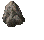 | 6007 (0x1777) | 0, 0, 0 | 0 |
|  | 6008 (0x1778) | 0, 0, 0 | 0 |
|  | 6009 (0x1779) | 0, 0, 0 | 0 |
|  | 6010 (0x177A) | 0, 0, 0 | 0 |
| 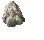 | 6011 (0x177B) | 0, 0, 0 | 0 |
|  | 6012 (0x177C) | 0, 0, 0 | 0 |

## Mushrooms

| Item | ID (Hex) | X, Y, Z | Frequency |
|:----:|:--------:|:-------:|:---------:|
|  | 3340 (0x0D0C) | 0, 0, 0 | 0 |
| 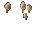 | 3341 (0x0D0D) | 0, 0, 0 | 0 |
|  | 3342 (0x0D0E) | 0, 0, 0 | 0 |
|  | 3343 (0x0D0F) | 0, 0, 0 | 0 |
| 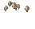 | 3344 (0x0D10) | 0, 0, 0 | 0 |
|  | 3345 (0x0D11) | 0, 0, 0 | 0 |
|  | 3346 (0x0D12) | 0, 0, 0 | 0 |
|  | 3347 (0x0D13) | 0, 0, 0 | 0 |
|  | 3348 (0x0D14) | 0, 0, 0 | 0 |
|  | 3349 (0x0D15) | 0, 0, 0 | 2 |
|  | 3350 (0x0D16) | 0, 0, 0 | 2 |
|  | 3351 (0x0D17) | 0, 0, 0 | 2 |
|  | 3352 (0x0D18) | 0, 0, 0 | 2 |
|  | 3353 (0x0D19) | 0, 0, 0 | 2 |

## Grasses

| Item | ID (Hex) | X, Y, Z | Frequency |
|:----:|:--------:|:-------:|:---------:|
|  | 3244 (0x0CAC) | 0, 0, 0 | 2 |
|  | 3245 (0x0CAD) | 0, 0, 0 | 2 |
|  | 3246 (0x0CAE) | 0, 0, 0 | 2 |
|  | 3247 (0x0CAF) | 0, 0, 0 | 2 |
|  | 3248 (0x0CB0) | 0, 0, 0 | 2 |
|  | 3249 (0x0CB1) | 0, 0, 0 | 2 |
|  | 3250 (0x0CB2) | 0, 0, 0 | 0 |
|  | 3251 (0x0CB3) | 0, 0, 0 | 0 |
|  | 3252 (0x0CB4) | 0, 0, 0 | 2 |
|  | 3253 (0x0CB5) | 0, 0, 0 | 0 |
| 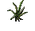 | 3254 (0x0CB6) | 0, 0, 0 | 0 |
|  | 3255 (0x0CB7) | 0, 0, 0 | 0 |
|  | 3256 (0x0CB8) | 0, 0, 0 | 0 |
|  | 3257 (0x0CB9) | 0, 0, 0 | 0 |
|  | 3258 (0x0CBA) | 0, 0, 0 | 0 |
|  | 3259 (0x0CBB) | 0, 0, 0 | 0 |
| 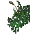 | 3260 (0x0CBC) | 0, 0, 0 | 0 |
|  | 3261 (0x0CBD) | 0, 0, 0 | 0 |

## Blade plant

| Item | ID (Hex) | X, Y, Z | Frequency |
|:----:|:--------:|:-------:|:---------:|
|  | 3219 (0x0C93) | 0, 0, 0 | 1 |

## Bulrushes

| Item | ID (Hex) | X, Y, Z | Frequency |
|:----:|:--------:|:-------:|:---------:|
| 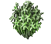 | 3220 (0x0C94) | 0, 0, 0 | 1 |

## Elephant ear plant

| Item | ID (Hex) | X, Y, Z | Frequency |
|:----:|:--------:|:-------:|:---------:|
|  | 3223 (0x0C97) | 0, 0, 0 | 1 |

## Fan plant

| Item | ID (Hex) | X, Y, Z | Frequency |
|:----:|:--------:|:-------:|:---------:|
|  | 3224 (0x0C98) | 0, 0, 0 | 1 |

## Fern

| Item | ID (Hex) | X, Y, Z | Frequency |
|:----:|:--------:|:-------:|:---------:|
|  | 3231 (0x0C9F) | 0, 0, 0 | 3 |
|  | 3232 (0x0CA0) | 0, 0, 0 | 2 |
|  | 3234 (0x0CA2) | 0, 0, 0 | 2 |
|  | 3235 (0x0CA3) | 0, 0, 0 | 3 |
|  | 3236 (0x0CA4) | 0, 0, 0 | 2 |

## Large fern

| Item | ID (Hex) | X, Y, Z | Frequency |
|:----:|:--------:|:-------:|:---------:|
|  | 3233 (0x0CA1) | 0, 0, 0 | 2 |

## Pampas Grass

| Item | ID (Hex) | X, Y, Z | Frequency |
|:----:|:--------:|:-------:|:---------:|
|  | 3237 (0x0CA5) | 0, 0, 0 | 3 |

## Rushes

| Item | ID (Hex) | X, Y, Z | Frequency |
|:----:|:--------:|:-------:|:---------:|
|  | 3239 (0x0CA7) | 0, 0, 0 | 3 |

##  Snake plant

| Item | ID (Hex) | X, Y, Z | Frequency |
|:----:|:--------:|:-------:|:---------:|
| 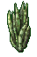 | 3241 (0x0CA9) | 0, 0, 0 | 0 |

## Twigs

| Item | ID (Hex) | X, Y, Z | Frequency |
|:----:|:--------:|:-------:|:---------:|
|  | 7068 (0x1B9C) | 0, 0, 0 | 0 |
|  | 7069 (0x1B9D) | 0, 0, 0 | 0 |
|  | 7070 (0x1B9E) | 0, 0, 0 | 0 |

## Sapling

| Item | ID (Hex) | X, Y, Z | Frequency |
|:----:|:--------:|:-------:|:---------:|
|  | 3305 (0x0CE9) | 0, 0, 0 | 1 |
|  | 3306 (0x0CEA) | 0, 0, 0 | 1 |

## fallen log N/S

| Item | ID (Hex) | X, Y, Z | Frequency |
|:----:|:--------:|:-------:|:---------:|
| 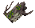 | 3315 (0x0CF3) | 0, 0, 0 | 1 |
|  | 3316 (0x0CF4) | 0, 1, 0 | 1 |

## fallen log W/E

| Item | ID (Hex) | X, Y, Z | Frequency |
|:----:|:--------:|:-------:|:---------:|
|  | 3317 (0x0CF5) | 0, 0, 0 | 1 |
|  | 3318 (0x0CF6) | 1, 0, 0 | 1 |
| 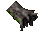 | 3319 (0x0CF7) | 2, 0, 0 | 1 |

## Morning Glories

| Item | ID (Hex) | X, Y, Z | Frequency |
|:----:|:--------:|:-------:|:---------:|
|  | 3380 (0x0D34) | 0, 0, 0 | 0 |

## Flowers

| Item | ID (Hex) | X, Y, Z | Frequency |
|:----:|:--------:|:-------:|:---------:|
|  | 3127 (0x0C37) | 0, 0, 0 | 0 |
|  | 3128 (0x0C38) | 0, 0, 0 | 0 |
| 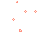 | 3141 (0x0C45) | 0, 0, 0 | 0 |
| 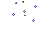 | 3142 (0x0C46) | 0, 0, 0 | 0 |
|  | 3143 (0x0C47) | 0, 0, 0 | 0 |
|  | 3144 (0x0C48) | 0, 0, 0 | 0 |
| 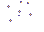 | 3145 (0x0C49) | 0, 0, 0 | 0 |
|  | 3146 (0x0C4A) | 0, 0, 0 | 0 |
|  | 3147 (0x0C4B) | 0, 0, 0 | 0 |
|  | 3148 (0x0C4C) | 0, 0, 0 | 0 |
|  | 3149 (0x0C4D) | 0, 0, 0 | 0 |
|  | 3150 (0x0C4E) | 0, 0, 0 | 0 |

## Foxglove flower

| Item | ID (Hex) | X, Y, Z | Frequency |
|:----:|:--------:|:-------:|:---------:|
|  | 3204 (0x0C84) | 0, 0, 0 | 0 |

## Ourflour flower

| Item | ID (Hex) | X, Y, Z | Frequency |
|:----:|:--------:|:-------:|:---------:|
|  | 3205 (0x0C85) | 0, 0, 0 | 0 |

## Campion flowers

| Item | ID (Hex) | X, Y, Z | Frequency |
|:----:|:--------:|:-------:|:---------:|
|  | 3207 (0x0C87) | 0, 0, 0 | 0 |

## Poppies

| Item | ID (Hex) | X, Y, Z | Frequency |
|:----:|:--------:|:-------:|:---------:|
|  | 3262 (0x0CBE) | 0, 0, 0 | 0 |
|  | 3263 (0x0CBF) | 0, 0, 0 | 0 |
