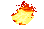
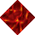
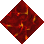

# Lava

_Generated on 2024-12-13 11:26:34_

## Bubbling Lave 

| Item | ID (Hex) | X, Y, Z | Frequency |
|:----:|:--------:|:-------:|:---------:|
|  | 6773 (0x1A75) | 0, 0, 0 | 5 |

## Open Fire

| Item | ID (Hex) | X, Y, Z | Frequency |
|:----:|:--------:|:-------:|:---------:|
|  | 6571 (0x19AB) | 0, 0, 0 | 5 |

## Lava

| Item | ID (Hex) | X, Y, Z | Frequency |
|:----:|:--------:|:-------:|:---------:|
|  | 13401 (0x3459) | 0, 0, 0 | 5 |
|  | 13371 (0x343B) | 0, 0, 0 | 5 |
|  | 13383 (0x3447) | 0, 0, 0 | 5 |
