# Sand

_Generated on 2024-12-13 11:26:34_

## Banana tree (small)

| Item | ID (Hex) | X, Y, Z | Frequency |
|:----:|:--------:|:-------:|:---------:|
| 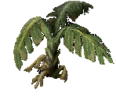 | 3240 (0x0CA8) | 0, 0, 0 | 1 |

## Banana tree 

| Item | ID (Hex) | X, Y, Z | Frequency |
|:----:|:--------:|:-------:|:---------:|
| 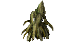 | 3243 (0x0CAB) | 0, 0, 0 | 1 |

## Cactus

| Item | ID (Hex) | X, Y, Z | Frequency |
|:----:|:--------:|:-------:|:---------:|
| 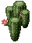 | 3365 (0x0D25) | 0, 0, 0 | 2 |
| 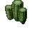 | 3367 (0x0D27) | 0, 0, 0 | 2 |
| 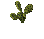 | 3368 (0x0D28) | 0, 0, 0 | 2 |
| 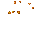 | 3369 (0x0D29) | 0, 0, 0 | 2 |
| 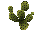 | 3372 (0x0D2C) | 0, 0, 0 | 2 |
| 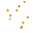 | 3373 (0x0D2D) | 0, 0, 0 | 2 |

## Grasses

| Item | ID (Hex) | X, Y, Z | Frequency |
|:----:|:--------:|:-------:|:---------:|
|  | 3378 (0x0D32) | 0, 0, 0 | 1 |
| 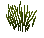 | 3379 (0x0D33) | 0, 0, 0 | 1 |

## Oasis

| Item | ID (Hex) | X, Y, Z | Frequency |
|:----:|:--------:|:-------:|:---------:|
| 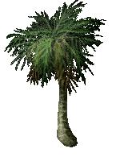 | 3222 (0x0C96) | -1, -1, 0 | 1 |
| 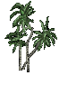 | 3229 (0x0C9D) | -1, 0, 0 | 1 |
| 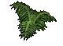 | 3231 (0x0C9F) | 0, -1, 0 | 1 |
| 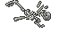 | 3791 (0x0ECF) | -1, 0, 0 | 1 |

## Bones1

| Item | ID (Hex) | X, Y, Z | Frequency |
|:----:|:--------:|:-------:|:---------:|
| 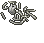 | 3794 (0x0ED2) | 0, 0, 0 | 2 |

## Bones2

| Item | ID (Hex) | X, Y, Z | Frequency |
|:----:|:--------:|:-------:|:---------:|
| 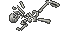 | 3792 (0x0ED0) | 0, 0, 0 | 2 |
