# Swamp

_Generated on 2024-12-13 11:26:34_

## Cyprus Tree

| Item | ID (Hex) | X, Y, Z | Frequency |
|:----:|:--------:|:-------:|:---------:|
|  | 3320 (0x0CF8) | 0, 0, 0 | 0 |
|  | 3323 (0x0CFB) | 0, 0, 0 | 0 |
|  | 3323 (0x0CFB) | 0, 0, 0 | 2 |
|  | 3324 (0x0CFC) | 0, 0, 0 | 2 |
|  | 3323 (0x0CFB) | 0, 0, 0 | 0 |
|  | 3325 (0x0CFD) | 0, 0, 0 | 0 |
|  | 3326 (0x0CFE) | 0, 0, 0 | 0 |
|  | 3326 (0x0CFE) | 0, 0, 0 | 2 |
|  | 3327 (0x0CFF) | 0, 0, 0 | 2 |
|  | 3326 (0x0CFE) | 0, 0, 0 | 0 |
|  | 3328 (0x0D00) | 0, 0, 0 | 0 |
| 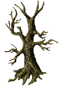 | 3329 (0x0D01) | 0, 0, 0 | 0 |

## Reeds

| Item | ID (Hex) | X, Y, Z | Frequency |
|:----:|:--------:|:-------:|:---------:|
|  | 3333 (0x0D05) | 0, 0, 0 | 6 |

## Lilypad

| Item | ID (Hex) | X, Y, Z | Frequency |
|:----:|:--------:|:-------:|:---------:|
|  | 3334 (0x0D06) | 0, 0, 0 | 2 |
|  | 3335 (0x0D07) | 0, 0, 0 | 2 |
|  | 3336 (0x0D08) | 0, 0, 0 | 2 |
|  | 3337 (0x0D09) | 0, 0, 0 | 2 |
|  | 3338 (0x0D0A) | 0, 0, 0 | 2 |
|  | 3339 (0x0D0B) | 0, 0, 0 | 2 |
|  | 3340 (0x0D0C) | 0, 0, 0 | 2 |
|  | 3341 (0x0D0D) | 0, 0, 0 | 2 |
| 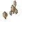 | 3342 (0x0D0E) | 0, 0, 0 | 2 |

## Water Lily

| Item | ID (Hex) | X, Y, Z | Frequency |
|:----:|:--------:|:-------:|:---------:|
|  | 3521 (0x0DC1) | 0, 0, 0 | 2 |
|  | 3522 (0x0DC2) | 0, 0, 0 | 2 |
|  | 3523 (0x0DC3) | 0, 0, 0 | 2 |

## Sunken Log

| Item | ID (Hex) | X, Y, Z | Frequency |
|:----:|:--------:|:-------:|:---------:|
|  | 12881 (0x3251) | 0, 0, 0 | 4 |
|  | 12880 (0x3250) | 1, 0, 0 | 4 |
|  | 12879 (0x324F) | 0, 0, 0 | 4 |
|  | 12878 (0x324E) | 0, 1, 0 | 4 |

## Stump

| Item | ID (Hex) | X, Y, Z | Frequency |
|:----:|:--------:|:-------:|:---------:|
|  | 12875 (0x324B) | 0, 0, 0 | 0 |
|  | 12876 (0x324C) | 0, 0, 0 | 4 |
|  | 12877 (0x324D) | 0, 0, 0 | 4 |

## Animated Tile

| Item | ID (Hex) | X, Y, Z | Frequency |
|:----:|:--------:|:-------:|:---------:|
| 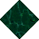 | 12813 (0x320D) | 0, 0, 0 | 1 |
|  | 12819 (0x3213) | 0, 0, 0 | 1 |
|  | 12826 (0x321A) | 0, 0, 0 | 1 |
|  | 12832 (0x3220) | 0, 0, 0 | 0 |
|  | 12844 (0x322C) | 0, 0, 0 | 2 |
|  | 12854 (0x3236) | 0, 0, 0 | 2 |
|  | 12865 (0x3241) | 0, 0, 0 | 2 |

## Cattails

| Item | ID (Hex) | X, Y, Z | Frequency |
|:----:|:--------:|:-------:|:---------:|
| 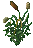 | 3255 (0x0CB7) | 0, 0, 0 | 1 |
| 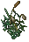 | 3256 (0x0CB8) | 0, 0, 0 | 1 |

## Water Plants

| Item | ID (Hex) | X, Y, Z | Frequency |
|:----:|:--------:|:-------:|:---------:|
|  | 3332 (0x0D04) | 0, 0, 0 | 8 |

## Cedar Tree

| Item | ID (Hex) | X, Y, Z | Frequency |
|:----:|:--------:|:-------:|:---------:|
|  | 3286 (0x0CD6) | 0, 0, 0 | 0 |

## Tree

| Item | ID (Hex) | X, Y, Z | Frequency |
|:----:|:--------:|:-------:|:---------:|
|  | 3274 (0x0CCA) | 0, 0, 0 | 0 |
| 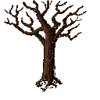 | 3275 (0x0CCB) | 0, 0, 0 | 0 |
|  | 3276 (0x0CCC) | 0, 0, 0 | 0 |
| 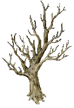 | 3277 (0x0CCD) | 0, 0, 0 | 0 |

## Fan plant

| Item | ID (Hex) | X, Y, Z | Frequency |
|:----:|:--------:|:-------:|:---------:|
|  | 3224 (0x0C98) | 0, 0, 0 | 0 |

## Fern

| Item | ID (Hex) | X, Y, Z | Frequency |
|:----:|:--------:|:-------:|:---------:|
|  | 3231 (0x0C9F) | 0, 0, 0 | 0 |
|  | 3232 (0x0CA0) | 0, 0, 0 | 0 |
|  | 3234 (0x0CA2) | 0, 0, 0 | 0 |
| 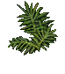 | 3235 (0x0CA3) | 0, 0, 0 | 0 |
|  | 3236 (0x0CA4) | 0, 0, 0 | 0 |
|  | 3518 (0x0DBE) | 0, 0, 0 | 0 |
|  | 3516 (0x0DBC) | 0, 0, 0 | 0 |
| 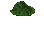 | 3517 (0x0DBD) | 0, 0, 0 | 0 |
|  | 3521 (0x0DC1) | 0, 0, 0 | 0 |
|  | 3522 (0x0DC2) | 0, 0, 0 | 0 |
|  | 3523 (0x0DC3) | 0, 0, 0 | 0 |

## Large fern

| Item | ID (Hex) | X, Y, Z | Frequency |
|:----:|:--------:|:-------:|:---------:|
| 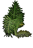 | 3233 (0x0CA1) | 0, 0, 0 | 0 |

## Swamp Water

| Item | ID (Hex) | X, Y, Z | Frequency |
|:----:|:--------:|:-------:|:---------:|
|  | 6044 (0x179C) | 0, 0, 0 | 0 |
|  | 6045 (0x179D) | 1, 0, 0 | 0 |
|  | 6047 (0x179F) | 0, -1, 0 | 0 |
|  | 6049 (0x17A1) | 0, 1, 0 | 0 |
|  | 6051 (0x17A3) | -1, 0, 0 | 0 |
|  | 6053 (0x17A5) | 1, -1, 0 | 0 |
|  | 6054 (0x17A6) | -1, -1, 0 | 0 |
| 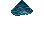 | 6055 (0x17A7) | 1, 1, 0 | 0 |
|  | 6056 (0x17A8) | -1, 1, 0 | 0 |
|  | 3521 (0x0DC1) | -1, 0, 0 | 0 |
|  | 3522 (0x0DC2) | 0, 0, 0 | 0 |
|  | 3518 (0x0DBE) | 0, 1, 0 | 0 |
|  | 3517 (0x0DBD) | 1, 0, 0 | 0 |
|  | 3516 (0x0DBC) | 0, -1, 0 | 0 |
