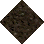

# Beach No Statics to Dirt Small

_Generated on 2024-12-13 11:26:34_

## Top

### Tiles

| Tile | ID (Hex) | Z | Chance |
|:----:|:--------:|:--:|:------:|
|  | 824 (0x0338) | 0 | 100% |

### Statics

_None_

## Left

### Tiles

| Tile | ID (Hex) | Z | Chance |
|:----:|:--------:|:--:|:------:|
|  | 823 (0x0337) | 0 | 100% |

### Statics

_None_

## Right

### Tiles

| Tile | ID (Hex) | Z | Chance |
|:----:|:--------:|:--:|:------:|
|  | 822 (0x0336) | 0 | 100% |

### Statics

_None_

## Bottom

### Tiles

| Tile | ID (Hex) | Z | Chance |
|:----:|:--------:|:--:|:------:|
|  | 821 (0x0335) | 0 | 100% |

### Statics

_None_

## Bottom Right

### Tiles

| Tile | ID (Hex) | Z | Chance |
|:----:|:--------:|:--:|:------:|
|  | 829 (0x033D) | 0 | 100% |

### Statics

_None_

## Top Left

### Tiles

| Tile | ID (Hex) | Z | Chance |
|:----:|:--------:|:--:|:------:|
|  | 830 (0x033E) | 0 | 100% |

### Statics

_None_

## Bottom Left

### Tiles

| Tile | ID (Hex) | Z | Chance |
|:----:|:--------:|:--:|:------:|
|  | 831 (0x033F) | 0 | 100% |

### Statics

_None_

## Top Right

### Tiles

| Tile | ID (Hex) | Z | Chance |
|:----:|:--------:|:--:|:------:|
|  | 832 (0x0340) | 0 | 100% |

### Statics

_None_

## Outer Top Left

### Tiles

| Tile | ID (Hex) | Z | Chance |
|:----:|:--------:|:--:|:------:|
|  | 825 (0x0339) | 0 | 100% |

### Statics

_None_

## Outer Bottom Right

### Tiles

| Tile | ID (Hex) | Z | Chance |
|:----:|:--------:|:--:|:------:|
|  | 826 (0x033A) | 0 | 100% |

### Statics

_None_

## Outer Top Right

### Tiles

| Tile | ID (Hex) | Z | Chance |
|:----:|:--------:|:--:|:------:|
|  | 827 (0x033B) | 0 | 100% |

### Statics

_None_

## Outer Bottom Left

### Tiles

| Tile | ID (Hex) | Z | Chance |
|:----:|:--------:|:--:|:------:|
|  | 828 (0x033C) | 0 | 100% |

### Statics

_None_

## Autocorrect

### Tiles

| Tile | ID (Hex) | Z | Chance |
|:----:|:--------:|:--:|:------:|
|  | 117 (0x0075) | 0 | 25% |
|  | 118 (0x0076) | 0 | 25% |
|  | 119 (0x0077) | 0 | 25% |
|  | 120 (0x0078) | 0 | 25% |

### Statics

_None_

## Invalid

### Tiles

| Tile | ID (Hex) | Z | Chance |
|:----:|:--------:|:--:|:------:|
|  | 22 (0x0016) | 0 | 25% |
|  | 23 (0x0017) | 0 | 25% |
|  | 24 (0x0018) | 0 | 25% |
|  | 25 (0x0019) | 0 | 25% |

### Statics

_None_
