# Beach No Statics to Lava

_Generated on 2024-12-13 11:26:34_

## Top

### Tiles

| Tile | ID (Hex) | Z | Chance |
|:----:|:--------:|:--:|:------:|
|  | 22 (0x0016) | 0 | 25% |
| 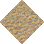 | 23 (0x0017) | 0 | 25% |
|  | 24 (0x0018) | 0 | 25% |
|  | 25 (0x0019) | 0 | 25% |

### Statics

| Tile | ID (Hex) | Z | Chance |
|:----:|:--------:|:--:|:------:|
| 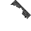 | 12972 (0x32AC) | 0 | 50% |
| 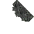 | 12973 (0x32AD) | 0 | 50% |

## Left

### Tiles

| Tile | ID (Hex) | Z | Chance |
|:----:|:--------:|:--:|:------:|
|  | 22 (0x0016) | 0 | 25% |
|  | 23 (0x0017) | 0 | 25% |
|  | 24 (0x0018) | 0 | 25% |
|  | 25 (0x0019) | 0 | 25% |

### Statics

| Tile | ID (Hex) | Z | Chance |
|:----:|:--------:|:--:|:------:|
| 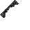 | 12976 (0x32B0) | 0 | 50% |
| 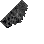 | 12977 (0x32B1) | 0 | 50% |

## Right

### Tiles

| Tile | ID (Hex) | Z | Chance |
|:----:|:--------:|:--:|:------:|
|  | 22 (0x0016) | 0 | 25% |
|  | 23 (0x0017) | 0 | 25% |
|  | 24 (0x0018) | 0 | 25% |
|  | 25 (0x0019) | 0 | 25% |

### Statics

| Tile | ID (Hex) | Z | Chance |
|:----:|:--------:|:--:|:------:|
| 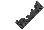 | 12970 (0x32AA) | 0 | 50% |
| 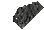 | 12971 (0x32AB) | 0 | 50% |

## Bottom

### Tiles

| Tile | ID (Hex) | Z | Chance |
|:----:|:--------:|:--:|:------:|
|  | 22 (0x0016) | 0 | 25% |
|  | 23 (0x0017) | 0 | 25% |
|  | 24 (0x0018) | 0 | 25% |
|  | 25 (0x0019) | 0 | 25% |

### Statics

| Tile | ID (Hex) | Z | Chance |
|:----:|:--------:|:--:|:------:|
| 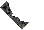 | 12974 (0x32AE) | 0 | 50% |
| 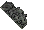 | 12975 (0x32AF) | 0 | 50% |

## Bottom Right

### Tiles

| Tile | ID (Hex) | Z | Chance |
|:----:|:--------:|:--:|:------:|
|  | 22 (0x0016) | 0 | 25% |
|  | 23 (0x0017) | 0 | 25% |
|  | 24 (0x0018) | 0 | 25% |
|  | 25 (0x0019) | 0 | 25% |

### Statics

| Tile | ID (Hex) | Z | Chance |
|:----:|:--------:|:--:|:------:|
| 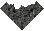 | 12962 (0x32A2) | 0 | 100% |

## Top Left

### Tiles

| Tile | ID (Hex) | Z | Chance |
|:----:|:--------:|:--:|:------:|
|  | 22 (0x0016) | 0 | 25% |
|  | 23 (0x0017) | 0 | 25% |
|  | 24 (0x0018) | 0 | 25% |
|  | 25 (0x0019) | 0 | 25% |

### Statics

| Tile | ID (Hex) | Z | Chance |
|:----:|:--------:|:--:|:------:|
| 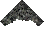 | 12964 (0x32A4) | 0 | 100% |

## Bottom Left

### Tiles

| Tile | ID (Hex) | Z | Chance |
|:----:|:--------:|:--:|:------:|
|  | 22 (0x0016) | 0 | 25% |
|  | 23 (0x0017) | 0 | 25% |
|  | 24 (0x0018) | 0 | 25% |
|  | 25 (0x0019) | 0 | 25% |

### Statics

| Tile | ID (Hex) | Z | Chance |
|:----:|:--------:|:--:|:------:|
| 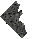 | 12965 (0x32A5) | 0 | 100% |

## Top Right

### Tiles

| Tile | ID (Hex) | Z | Chance |
|:----:|:--------:|:--:|:------:|
|  | 22 (0x0016) | 0 | 25% |
|  | 23 (0x0017) | 0 | 25% |
|  | 24 (0x0018) | 0 | 25% |
|  | 25 (0x0019) | 0 | 25% |

### Statics

| Tile | ID (Hex) | Z | Chance |
|:----:|:--------:|:--:|:------:|
| 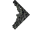 | 12963 (0x32A3) | 0 | 100% |

## Outer Top Left

### Tiles

| Tile | ID (Hex) | Z | Chance |
|:----:|:--------:|:--:|:------:|
|  | 22 (0x0016) | 0 | 25% |
|  | 23 (0x0017) | 0 | 25% |
|  | 24 (0x0018) | 0 | 25% |
|  | 25 (0x0019) | 0 | 25% |

### Statics

| Tile | ID (Hex) | Z | Chance |
|:----:|:--------:|:--:|:------:|
|  | 12961 (0x32A1) | 0 | 50% |
|  | 12967 (0x32A7) | 0 | 50% |

## Outer Bottom Right

### Tiles

| Tile | ID (Hex) | Z | Chance |
|:----:|:--------:|:--:|:------:|
|  | 22 (0x0016) | 0 | 25% |
|  | 23 (0x0017) | 0 | 25% |
|  | 24 (0x0018) | 0 | 25% |
|  | 25 (0x0019) | 0 | 25% |

### Statics

| Tile | ID (Hex) | Z | Chance |
|:----:|:--------:|:--:|:------:|
|  | 12968 (0x32A8) | 0 | 100% |

## Outer Top Right

### Tiles

| Tile | ID (Hex) | Z | Chance |
|:----:|:--------:|:--:|:------:|
|  | 22 (0x0016) | 0 | 25% |
|  | 23 (0x0017) | 0 | 25% |
|  | 24 (0x0018) | 0 | 25% |
|  | 25 (0x0019) | 0 | 25% |

### Statics

| Tile | ID (Hex) | Z | Chance |
|:----:|:--------:|:--:|:------:|
|  | 12960 (0x32A0) | 0 | 50% |
|  | 12966 (0x32A6) | 0 | 50% |

## Outer Bottom Left

### Tiles

| Tile | ID (Hex) | Z | Chance |
|:----:|:--------:|:--:|:------:|
|  | 22 (0x0016) | 0 | 25% |
|  | 23 (0x0017) | 0 | 25% |
|  | 24 (0x0018) | 0 | 25% |
|  | 25 (0x0019) | 0 | 25% |

### Statics

| Tile | ID (Hex) | Z | Chance |
|:----:|:--------:|:--:|:------:|
|  | 12958 (0x329E) | 0 | 50% |
|  | 12969 (0x32A9) | 0 | 50% |

## Autocorrect

### Tiles

| Tile | ID (Hex) | Z | Chance |
|:----:|:--------:|:--:|:------:|
| 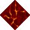 | 500 (0x01F4) | 0 | 25% |
| 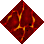 | 501 (0x01F5) | 0 | 25% |
| 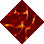 | 502 (0x01F6) | 0 | 25% |
| 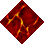 | 503 (0x01F7) | 0 | 25% |

### Statics

_None_

## Invalid

### Tiles

| Tile | ID (Hex) | Z | Chance |
|:----:|:--------:|:--:|:------:|
|  | 22 (0x0016) | 0 | 25% |
|  | 23 (0x0017) | 0 | 25% |
|  | 24 (0x0018) | 0 | 25% |
|  | 25 (0x0019) | 0 | 25% |

### Statics

_None_
