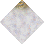
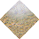
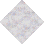
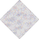
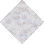
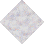

# Beach No Statics to Snow Rough

_Generated on 2024-12-13 11:26:34_

## Top

### Tiles

| Tile | ID (Hex) | Z | Chance |
|:----:|:--------:|:--:|:------:|
|  | 14473 (0x3889) | 0 | 100% |

### Statics

_None_

## Left

### Tiles

| Tile | ID (Hex) | Z | Chance |
|:----:|:--------:|:--:|:------:|
|  | 14471 (0x3887) | 0 | 100% |

### Statics

_None_

## Right

### Tiles

| Tile | ID (Hex) | Z | Chance |
|:----:|:--------:|:--:|:------:|
|  | 14470 (0x3886) | 0 | 100% |

### Statics

_None_

## Bottom

### Tiles

| Tile | ID (Hex) | Z | Chance |
|:----:|:--------:|:--:|:------:|
|  | 14472 (0x3888) | 0 | 100% |

### Statics

_None_

## Bottom Right

### Tiles

| Tile | ID (Hex) | Z | Chance |
|:----:|:--------:|:--:|:------:|
|  | 14477 (0x388D) | 0 | 100% |

### Statics

_None_

## Top Left

### Tiles

| Tile | ID (Hex) | Z | Chance |
|:----:|:--------:|:--:|:------:|
|  | 14476 (0x388C) | 0 | 100% |

### Statics

_None_

## Bottom Left

### Tiles

| Tile | ID (Hex) | Z | Chance |
|:----:|:--------:|:--:|:------:|
|  | 14474 (0x388A) | 0 | 100% |

### Statics

_None_

## Top Right

### Tiles

| Tile | ID (Hex) | Z | Chance |
|:----:|:--------:|:--:|:------:|
|  | 14475 (0x388B) | 0 | 100% |

### Statics

_None_

## Outer Top Left

### Tiles

| Tile | ID (Hex) | Z | Chance |
|:----:|:--------:|:--:|:------:|
|  | 14468 (0x3884) | 0 | 100% |

### Statics

_None_

## Outer Bottom Right

### Tiles

| Tile | ID (Hex) | Z | Chance |
|:----:|:--------:|:--:|:------:|
|  | 14466 (0x3882) | 0 | 100% |

### Statics

_None_

## Outer Top Right

### Tiles

| Tile | ID (Hex) | Z | Chance |
|:----:|:--------:|:--:|:------:|
|  | 14469 (0x3885) | 0 | 100% |

### Statics

_None_

## Outer Bottom Left

### Tiles

| Tile | ID (Hex) | Z | Chance |
|:----:|:--------:|:--:|:------:|
|  | 14467 (0x3883) | 0 | 100% |

### Statics

_None_

## Autocorrect

### Tiles

| Tile | ID (Hex) | Z | Chance |
|:----:|:--------:|:--:|:------:|
|  | 282 (0x011A) | 0 | 25% |
|  | 283 (0x011B) | 0 | 25% |
|  | 284 (0x011C) | 0 | 25% |
|  | 285 (0x011D) | 0 | 25% |

### Statics

_None_

## Path

### Tiles

| Tile | ID (Hex) | Z | Chance |
|:----:|:--------:|:--:|:------:|
|  | 14484 (0x3894) | 0 | 100% |

### Statics

_None_

## Path

### Tiles

| Tile | ID (Hex) | Z | Chance |
|:----:|:--------:|:--:|:------:|
|  | 14485 (0x3895) | 0 | 100% |

### Statics

_None_
