# Beach Rough to Brick Brown EW

_Generated on 2024-12-13 11:26:31_

## Top

### Tiles

| Tile | ID (Hex) | Z | Chance |
|:----:|:--------:|:--:|:------:|
| 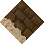 | 1180 (0x049C) | 0 | 100% |

### Statics

_None_

## Left

### Tiles

| Tile | ID (Hex) | Z | Chance |
|:----:|:--------:|:--:|:------:|
| 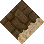 | 1181 (0x049D) | 0 | 100% |

### Statics

_None_

## Right

### Tiles

| Tile | ID (Hex) | Z | Chance |
|:----:|:--------:|:--:|:------:|
| 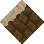 | 1179 (0x049B) | 0 | 100% |

### Statics

_None_

## Bottom

### Tiles

| Tile | ID (Hex) | Z | Chance |
|:----:|:--------:|:--:|:------:|
| 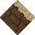 | 1182 (0x049E) | 0 | 100% |

### Statics

_None_

## Bottom Right

### Tiles

| Tile | ID (Hex) | Z | Chance |
|:----:|:--------:|:--:|:------:|
| 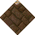 | 1183 (0x049F) | 0 | 100% |

### Statics

_None_

## Top Left

### Tiles

| Tile | ID (Hex) | Z | Chance |
|:----:|:--------:|:--:|:------:|
| 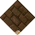 | 1185 (0x04A1) | 0 | 100% |

### Statics

_None_

## Bottom Left

### Tiles

| Tile | ID (Hex) | Z | Chance |
|:----:|:--------:|:--:|:------:|
| 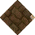 | 1186 (0x04A2) | 0 | 100% |

### Statics

_None_

## Top Right

### Tiles

| Tile | ID (Hex) | Z | Chance |
|:----:|:--------:|:--:|:------:|
| 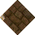 | 1184 (0x04A0) | 0 | 100% |

### Statics

_None_

## Outer Top Left

### Tiles

| Tile | ID (Hex) | Z | Chance |
|:----:|:--------:|:--:|:------:|
| 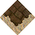 | 1176 (0x0498) | 0 | 100% |

### Statics

_None_

## Outer Bottom Right

### Tiles

| Tile | ID (Hex) | Z | Chance |
|:----:|:--------:|:--:|:------:|
| 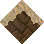 | 1178 (0x049A) | 0 | 100% |

### Statics

_None_

## Outer Top Right

### Tiles

| Tile | ID (Hex) | Z | Chance |
|:----:|:--------:|:--:|:------:|
| 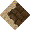 | 1175 (0x0497) | 0 | 100% |

### Statics

_None_

## Outer Bottom Left

### Tiles

| Tile | ID (Hex) | Z | Chance |
|:----:|:--------:|:--:|:------:|
| 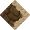 | 1177 (0x0499) | 0 | 100% |

### Statics

_None_

## Autocorrect

### Tiles

| Tile | ID (Hex) | Z | Chance |
|:----:|:--------:|:--:|:------:|
| 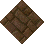 | 1167 (0x048F) | 0 | 25% |
| 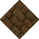 | 1168 (0x0490) | 0 | 25% |
| 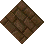 | 1169 (0x0491) | 0 | 25% |
| 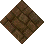 | 1170 (0x0492) | 0 | 25% |

### Statics

_None_

## Invalid

### Tiles

| Tile | ID (Hex) | Z | Chance |
|:----:|:--------:|:--:|:------:|
|  | 22 (0x0016) | 0 | 25% |
|  | 23 (0x0017) | 0 | 25% |
|  | 24 (0x0018) | 0 | 25% |
|  | 25 (0x0019) | 0 | 25% |

### Statics

_None_
