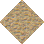

# Beach Rough to Planks EW

_Generated on 2024-12-13 11:26:31_

## Top

### Tiles

| Tile | ID (Hex) | Z | Chance |
|:----:|:--------:|:--:|:------:|
|  | 664 (0x0298) | 0 | 50% |
|  | 665 (0x0299) | 0 | 50% |

### Statics

_None_

## Left

### Tiles

| Tile | ID (Hex) | Z | Chance |
|:----:|:--------:|:--:|:------:|
|  | 668 (0x029C) | 0 | 50% |
|  | 669 (0x029D) | 0 | 50% |

### Statics

_None_

## Right

### Tiles

| Tile | ID (Hex) | Z | Chance |
|:----:|:--------:|:--:|:------:|
|  | 670 (0x029E) | 0 | 50% |
|  | 671 (0x029F) | 0 | 50% |

### Statics

_None_

## Bottom

### Tiles

| Tile | ID (Hex) | Z | Chance |
|:----:|:--------:|:--:|:------:|
|  | 666 (0x029A) | 0 | 50% |
|  | 667 (0x029B) | 0 | 50% |

### Statics

_None_

## Bottom Right

### Tiles

| Tile | ID (Hex) | Z | Chance |
|:----:|:--------:|:--:|:------:|
|  | 679 (0x02A7) | 0 | 100% |

### Statics

_None_

## Top Left

### Tiles

| Tile | ID (Hex) | Z | Chance |
|:----:|:--------:|:--:|:------:|
|  | 677 (0x02A5) | 0 | 100% |

### Statics

_None_

## Bottom Left

### Tiles

| Tile | ID (Hex) | Z | Chance |
|:----:|:--------:|:--:|:------:|
|  | 699 (0x02BB) | 0 | 100% |

### Statics

_None_

## Top Right

### Tiles

| Tile | ID (Hex) | Z | Chance |
|:----:|:--------:|:--:|:------:|
|  | 678 (0x02A6) | 0 | 100% |

### Statics

_None_

## Outer Top Left

### Tiles

| Tile | ID (Hex) | Z | Chance |
|:----:|:--------:|:--:|:------:|
|  | 675 (0x02A3) | 0 | 100% |

### Statics

_None_

## Outer Bottom Right

### Tiles

| Tile | ID (Hex) | Z | Chance |
|:----:|:--------:|:--:|:------:|
|  | 673 (0x02A1) | 0 | 100% |

### Statics

_None_

## Outer Top Right

### Tiles

| Tile | ID (Hex) | Z | Chance |
|:----:|:--------:|:--:|:------:|
|  | 672 (0x02A0) | 0 | 100% |

### Statics

_None_

## Outer Bottom Left

### Tiles

| Tile | ID (Hex) | Z | Chance |
|:----:|:--------:|:--:|:------:|
|  | 674 (0x02A2) | 0 | 100% |

### Statics

_None_

## Autocorrect

### Tiles

| Tile | ID (Hex) | Z | Chance |
|:----:|:--------:|:--:|:------:|
|  | 662 (0x0296) | 0 | 75% |
|  | 676 (0x02A4) | 0 | 25% |

### Statics

_None_

## Invalid

### Tiles

| Tile | ID (Hex) | Z | Chance |
|:----:|:--------:|:--:|:------:|
|  | 22 (0x0016) | 0 | 25% |
|  | 23 (0x0017) | 0 | 25% |
|  | 24 (0x0018) | 0 | 25% |
|  | 25 (0x0019) | 0 | 25% |

### Statics

_None_
