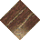

# Beach Rough to Planks NS

_Generated on 2024-12-13 11:26:31_

## Top

### Tiles

| Tile | ID (Hex) | Z | Chance |
|:----:|:--------:|:--:|:------:|
|  | 685 (0x02AD) | 0 | 50% |
|  | 686 (0x02AE) | 0 | 50% |

### Statics

_None_

## Left

### Tiles

| Tile | ID (Hex) | Z | Chance |
|:----:|:--------:|:--:|:------:|
|  | 681 (0x02A9) | 0 | 50% |
|  | 682 (0x02AA) | 0 | 50% |

### Statics

_None_

## Right

### Tiles

| Tile | ID (Hex) | Z | Chance |
|:----:|:--------:|:--:|:------:|
|  | 683 (0x02AB) | 0 | 50% |
|  | 684 (0x02AC) | 0 | 50% |

### Statics

_None_

## Bottom

### Tiles

| Tile | ID (Hex) | Z | Chance |
|:----:|:--------:|:--:|:------:|
|  | 687 (0x02AF) | 0 | 50% |
|  | 688 (0x02B0) | 0 | 50% |

### Statics

_None_

## Bottom Right

### Tiles

| Tile | ID (Hex) | Z | Chance |
|:----:|:--------:|:--:|:------:|
|  | 697 (0x02B9) | 0 | 100% |

### Statics

_None_

## Top Left

### Tiles

| Tile | ID (Hex) | Z | Chance |
|:----:|:--------:|:--:|:------:|
|  | 696 (0x02B8) | 0 | 100% |

### Statics

_None_

## Bottom Left

### Tiles

| Tile | ID (Hex) | Z | Chance |
|:----:|:--------:|:--:|:------:|
|  | 695 (0x02B7) | 0 | 100% |

### Statics

_None_

## Top Right

### Tiles

| Tile | ID (Hex) | Z | Chance |
|:----:|:--------:|:--:|:------:|
|  | 698 (0x02BA) | 0 | 100% |

### Statics

_None_

## Outer Top Left

### Tiles

| Tile | ID (Hex) | Z | Chance |
|:----:|:--------:|:--:|:------:|
|  | 692 (0x02B4) | 0 | 100% |

### Statics

_None_

## Outer Bottom Right

### Tiles

| Tile | ID (Hex) | Z | Chance |
|:----:|:--------:|:--:|:------:|
|  | 690 (0x02B2) | 0 | 100% |

### Statics

_None_

## Outer Top Right

### Tiles

| Tile | ID (Hex) | Z | Chance |
|:----:|:--------:|:--:|:------:|
|  | 691 (0x02B3) | 0 | 100% |

### Statics

_None_

## Outer Bottom Left

### Tiles

| Tile | ID (Hex) | Z | Chance |
|:----:|:--------:|:--:|:------:|
|  | 689 (0x02B1) | 0 | 100% |

### Statics

_None_

## Autocorrect

### Tiles

| Tile | ID (Hex) | Z | Chance |
|:----:|:--------:|:--:|:------:|
|  | 663 (0x0297) | 0 | 75% |
|  | 693 (0x02B5) | 0 | 25% |

### Statics

_None_

## Invalid

### Tiles

| Tile | ID (Hex) | Z | Chance |
|:----:|:--------:|:--:|:------:|
|  | 22 (0x0016) | 0 | 25% |
|  | 23 (0x0017) | 0 | 25% |
|  | 24 (0x0018) | 0 | 25% |
|  | 25 (0x0019) | 0 | 25% |

### Statics

_None_
