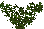
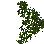
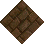

# Grass No Statics to Brick Brown NS

_Generated on 2024-12-13 11:26:32_

## Top

### Tiles

| Tile | ID (Hex) | Z | Chance |
|:----:|:--------:|:--:|:------:|
|  | 3 (0x0003) | 0 | 25% |
|  | 4 (0x0004) | 0 | 25% |
|  | 5 (0x0005) | 0 | 25% |
|  | 6 (0x0006) | 0 | 25% |

### Statics

| Tile | ID (Hex) | Z | Chance |
|:----:|:--------:|:--:|:------:|
|  | 6020 (0x1784) | 0 | 100% |

## Left

### Tiles

| Tile | ID (Hex) | Z | Chance |
|:----:|:--------:|:--:|:------:|
|  | 3 (0x0003) | 0 | 25% |
|  | 4 (0x0004) | 0 | 25% |
|  | 5 (0x0005) | 0 | 25% |
|  | 6 (0x0006) | 0 | 25% |

### Statics

| Tile | ID (Hex) | Z | Chance |
|:----:|:--------:|:--:|:------:|
|  | 6021 (0x1785) | 0 | 100% |

## Right

### Tiles

| Tile | ID (Hex) | Z | Chance |
|:----:|:--------:|:--:|:------:|
|  | 3 (0x0003) | 0 | 25% |
|  | 4 (0x0004) | 0 | 25% |
|  | 5 (0x0005) | 0 | 25% |
|  | 6 (0x0006) | 0 | 25% |

### Statics

| Tile | ID (Hex) | Z | Chance |
|:----:|:--------:|:--:|:------:|
|  | 6019 (0x1783) | 0 | 100% |

## Bottom

### Tiles

| Tile | ID (Hex) | Z | Chance |
|:----:|:--------:|:--:|:------:|
|  | 3 (0x0003) | 0 | 25% |
|  | 4 (0x0004) | 0 | 25% |
|  | 5 (0x0005) | 0 | 25% |
|  | 6 (0x0006) | 0 | 25% |

### Statics

| Tile | ID (Hex) | Z | Chance |
|:----:|:--------:|:--:|:------:|
|  | 6018 (0x1782) | 0 | 100% |

## Bottom Right

### Tiles

| Tile | ID (Hex) | Z | Chance |
|:----:|:--------:|:--:|:------:|
|  | 3 (0x0003) | 0 | 25% |
|  | 4 (0x0004) | 0 | 25% |
|  | 5 (0x0005) | 0 | 25% |
|  | 6 (0x0006) | 0 | 25% |

### Statics

| Tile | ID (Hex) | Z | Chance |
|:----:|:--------:|:--:|:------:|
|  | 6025 (0x1789) | 0 | 100% |

## Top Left

### Tiles

| Tile | ID (Hex) | Z | Chance |
|:----:|:--------:|:--:|:------:|
|  | 3 (0x0003) | 0 | 25% |
|  | 4 (0x0004) | 0 | 25% |
|  | 5 (0x0005) | 0 | 25% |
|  | 6 (0x0006) | 0 | 25% |

### Statics

| Tile | ID (Hex) | Z | Chance |
|:----:|:--------:|:--:|:------:|
|  | 6023 (0x1787) | 0 | 100% |

## Bottom Left

### Tiles

| Tile | ID (Hex) | Z | Chance |
|:----:|:--------:|:--:|:------:|
|  | 3 (0x0003) | 0 | 25% |
|  | 4 (0x0004) | 0 | 25% |
|  | 5 (0x0005) | 0 | 25% |
|  | 6 (0x0006) | 0 | 25% |

### Statics

| Tile | ID (Hex) | Z | Chance |
|:----:|:--------:|:--:|:------:|
|  | 6022 (0x1786) | 0 | 100% |

## Top Right

### Tiles

| Tile | ID (Hex) | Z | Chance |
|:----:|:--------:|:--:|:------:|
|  | 3 (0x0003) | 0 | 25% |
|  | 4 (0x0004) | 0 | 25% |
|  | 5 (0x0005) | 0 | 25% |
|  | 6 (0x0006) | 0 | 25% |

### Statics

| Tile | ID (Hex) | Z | Chance |
|:----:|:--------:|:--:|:------:|
|  | 6024 (0x1788) | 0 | 100% |

## Outer Top Left, Outer Bottom Right, Outer Top Right, Outer Bottom Left, Invalid

### Tiles

| Tile | ID (Hex) | Z | Chance |
|:----:|:--------:|:--:|:------:|
|  | 3 (0x0003) | 0 | 25% |
|  | 4 (0x0004) | 0 | 25% |
|  | 5 (0x0005) | 0 | 25% |
|  | 6 (0x0006) | 0 | 25% |

### Statics

_None_

## Autocorrect

### Tiles

| Tile | ID (Hex) | Z | Chance |
|:----:|:--------:|:--:|:------:|
|  | 1171 (0x0493) | 0 | 25% |
|  | 1172 (0x0494) | 0 | 25% |
|  | 1173 (0x0495) | 0 | 25% |
|  | 1174 (0x0496) | 0 | 25% |

### Statics

_None_
