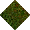
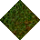
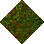
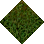

# Grass No Statics to Forest Yew

_Generated on 2024-12-13 11:26:32_

## Top

### Tiles

| Tile | ID (Hex) | Z | Chance |
|:----:|:--------:|:--:|:------:|
|  | 200 (0x00C8) | 0 | 33% |
|  | 1712 (0x06B0) | 0 | 33% |
|  | 1713 (0x06B1) | 0 | 33% |

### Statics

_None_

## Left

### Tiles

| Tile | ID (Hex) | Z | Chance |
|:----:|:--------:|:--:|:------:|
|  | 203 (0x00CB) | 0 | 25% |
|  | 204 (0x00CC) | 0 | 25% |
|  | 1711 (0x06AF) | 0 | 25% |
|  | 1716 (0x06B4) | 0 | 25% |

### Statics

_None_

## Right

### Tiles

| Tile | ID (Hex) | Z | Chance |
|:----:|:--------:|:--:|:------:|
|  | 206 (0x00CE) | 0 | 25% |
|  | 207 (0x00CF) | 0 | 25% |
|  | 1712 (0x06B0) | 0 | 25% |
|  | 1715 (0x06B3) | 0 | 25% |

### Statics

_None_

## Bottom

### Tiles

| Tile | ID (Hex) | Z | Chance |
|:----:|:--------:|:--:|:------:|
|  | 209 (0x00D1) | 0 | 33% |
|  | 1711 (0x06AF) | 0 | 33% |
|  | 1714 (0x06B2) | 0 | 33% |

### Statics

_None_

## Bottom Right

### Tiles

| Tile | ID (Hex) | Z | Chance |
|:----:|:--------:|:--:|:------:|
|  | 208 (0x00D0) | 0 | 50% |
|  | 1714 (0x06B2) | 0 | 50% |

### Statics

_None_

## Top Left

### Tiles

| Tile | ID (Hex) | Z | Chance |
|:----:|:--------:|:--:|:------:|
|  | 212 (0x00D4) | 0 | 50% |
|  | 1716 (0x06B4) | 0 | 50% |

### Statics

_None_

## Bottom Left

### Tiles

| Tile | ID (Hex) | Z | Chance |
|:----:|:--------:|:--:|:------:|
|  | 214 (0x00D6) | 0 | 100% |

### Statics

_None_

## Top Right

### Tiles

| Tile | ID (Hex) | Z | Chance |
|:----:|:--------:|:--:|:------:|
|  | 215 (0x00D7) | 0 | 100% |

### Statics

_None_

## Outer Top Left

### Tiles

| Tile | ID (Hex) | Z | Chance |
|:----:|:--------:|:--:|:------:|
|  | 216 (0x00D8) | 0 | 100% |

### Statics

_None_

## Outer Bottom Right

### Tiles

| Tile | ID (Hex) | Z | Chance |
|:----:|:--------:|:--:|:------:|
|  | 217 (0x00D9) | 0 | 100% |

### Statics

_None_

## Outer Top Right

### Tiles

| Tile | ID (Hex) | Z | Chance |
|:----:|:--------:|:--:|:------:|
|  | 218 (0x00DA) | 0 | 100% |

### Statics

_None_

## Outer Bottom Left

### Tiles

| Tile | ID (Hex) | Z | Chance |
|:----:|:--------:|:--:|:------:|
|  | 219 (0x00DB) | 0 | 100% |

### Statics

_None_

## Autocorrect

### Tiles

| Tile | ID (Hex) | Z | Chance |
|:----:|:--------:|:--:|:------:|
|  | 196 (0x00C4) | 0 | 25% |
|  | 197 (0x00C5) | 0 | 25% |
|  | 198 (0x00C6) | 0 | 25% |
|  | 199 (0x00C7) | 0 | 25% |

### Statics

_None_

## Invalid

### Tiles

| Tile | ID (Hex) | Z | Chance |
|:----:|:--------:|:--:|:------:|
|  | 3 (0x0003) | 0 | 25% |
|  | 4 (0x0004) | 0 | 25% |
|  | 5 (0x0005) | 0 | 25% |
|  | 6 (0x0006) | 0 | 25% |

### Statics

_None_
