# Jungle Rough to Void

_Generated on 2024-12-13 11:26:31_

## Top

### Tiles

| Tile | ID (Hex) | Z | Chance |
|:----:|:--------:|:--:|:------:|
| 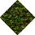 | 172 (0x00AC) | 0 | 25% |
| 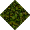 | 173 (0x00AD) | 0 | 25% |
| 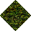 | 174 (0x00AE) | 0 | 25% |
| 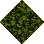 | 175 (0x00AF) | 0 | 25% |

### Statics

| Tile | ID (Hex) | Z | Chance |
|:----:|:--------:|:--:|:------:|
| 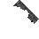 | 12972 (0x32AC) | 0 | 50% |
| 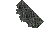 | 12973 (0x32AD) | 0 | 50% |

## Left

### Tiles

| Tile | ID (Hex) | Z | Chance |
|:----:|:--------:|:--:|:------:|
|  | 172 (0x00AC) | 0 | 25% |
|  | 173 (0x00AD) | 0 | 25% |
|  | 174 (0x00AE) | 0 | 25% |
|  | 175 (0x00AF) | 0 | 25% |

### Statics

| Tile | ID (Hex) | Z | Chance |
|:----:|:--------:|:--:|:------:|
| 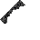 | 12976 (0x32B0) | 0 | 50% |
| 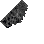 | 12977 (0x32B1) | 0 | 50% |

## Right

### Tiles

| Tile | ID (Hex) | Z | Chance |
|:----:|:--------:|:--:|:------:|
|  | 172 (0x00AC) | 0 | 25% |
|  | 173 (0x00AD) | 0 | 25% |
|  | 174 (0x00AE) | 0 | 25% |
|  | 175 (0x00AF) | 0 | 25% |

### Statics

| Tile | ID (Hex) | Z | Chance |
|:----:|:--------:|:--:|:------:|
| 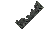 | 12970 (0x32AA) | 0 | 50% |
| 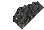 | 12971 (0x32AB) | 0 | 50% |

## Bottom

### Tiles

| Tile | ID (Hex) | Z | Chance |
|:----:|:--------:|:--:|:------:|
|  | 172 (0x00AC) | 0 | 25% |
|  | 173 (0x00AD) | 0 | 25% |
|  | 174 (0x00AE) | 0 | 25% |
|  | 175 (0x00AF) | 0 | 25% |

### Statics

| Tile | ID (Hex) | Z | Chance |
|:----:|:--------:|:--:|:------:|
| 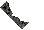 | 12974 (0x32AE) | 0 | 50% |
| 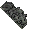 | 12975 (0x32AF) | 0 | 50% |

## Bottom Right

### Tiles

| Tile | ID (Hex) | Z | Chance |
|:----:|:--------:|:--:|:------:|
|  | 172 (0x00AC) | 0 | 25% |
|  | 173 (0x00AD) | 0 | 25% |
|  | 174 (0x00AE) | 0 | 25% |
|  | 175 (0x00AF) | 0 | 25% |

### Statics

| Tile | ID (Hex) | Z | Chance |
|:----:|:--------:|:--:|:------:|
| 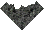 | 12962 (0x32A2) | 0 | 100% |

## Top Left

### Tiles

| Tile | ID (Hex) | Z | Chance |
|:----:|:--------:|:--:|:------:|
|  | 172 (0x00AC) | 0 | 25% |
|  | 173 (0x00AD) | 0 | 25% |
|  | 174 (0x00AE) | 0 | 25% |
|  | 175 (0x00AF) | 0 | 25% |

### Statics

| Tile | ID (Hex) | Z | Chance |
|:----:|:--------:|:--:|:------:|
| 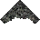 | 12964 (0x32A4) | 0 | 100% |

## Bottom Left

### Tiles

| Tile | ID (Hex) | Z | Chance |
|:----:|:--------:|:--:|:------:|
|  | 172 (0x00AC) | 0 | 25% |
|  | 173 (0x00AD) | 0 | 25% |
|  | 174 (0x00AE) | 0 | 25% |
|  | 175 (0x00AF) | 0 | 25% |

### Statics

| Tile | ID (Hex) | Z | Chance |
|:----:|:--------:|:--:|:------:|
| 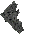 | 12965 (0x32A5) | 0 | 100% |

## Top Right

### Tiles

| Tile | ID (Hex) | Z | Chance |
|:----:|:--------:|:--:|:------:|
|  | 172 (0x00AC) | 0 | 25% |
|  | 173 (0x00AD) | 0 | 25% |
|  | 174 (0x00AE) | 0 | 25% |
|  | 175 (0x00AF) | 0 | 25% |

### Statics

| Tile | ID (Hex) | Z | Chance |
|:----:|:--------:|:--:|:------:|
| 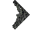 | 12963 (0x32A3) | 0 | 100% |

## Outer Top Left

### Tiles

| Tile | ID (Hex) | Z | Chance |
|:----:|:--------:|:--:|:------:|
|  | 172 (0x00AC) | 0 | 25% |
|  | 173 (0x00AD) | 0 | 25% |
|  | 174 (0x00AE) | 0 | 25% |
|  | 175 (0x00AF) | 0 | 25% |

### Statics

| Tile | ID (Hex) | Z | Chance |
|:----:|:--------:|:--:|:------:|
|  | 12961 (0x32A1) | 0 | 50% |
|  | 12967 (0x32A7) | 0 | 50% |

## Outer Bottom Right

### Tiles

| Tile | ID (Hex) | Z | Chance |
|:----:|:--------:|:--:|:------:|
|  | 172 (0x00AC) | 0 | 25% |
|  | 173 (0x00AD) | 0 | 25% |
|  | 174 (0x00AE) | 0 | 25% |
|  | 175 (0x00AF) | 0 | 25% |

### Statics

| Tile | ID (Hex) | Z | Chance |
|:----:|:--------:|:--:|:------:|
|  | 12968 (0x32A8) | 0 | 100% |

## Outer Top Right

### Tiles

| Tile | ID (Hex) | Z | Chance |
|:----:|:--------:|:--:|:------:|
|  | 172 (0x00AC) | 0 | 25% |
|  | 173 (0x00AD) | 0 | 25% |
|  | 174 (0x00AE) | 0 | 25% |
|  | 175 (0x00AF) | 0 | 25% |

### Statics

| Tile | ID (Hex) | Z | Chance |
|:----:|:--------:|:--:|:------:|
|  | 12960 (0x32A0) | 0 | 50% |
|  | 12966 (0x32A6) | 0 | 50% |

## Outer Bottom Left

### Tiles

| Tile | ID (Hex) | Z | Chance |
|:----:|:--------:|:--:|:------:|
|  | 172 (0x00AC) | 0 | 25% |
|  | 173 (0x00AD) | 0 | 25% |
|  | 174 (0x00AE) | 0 | 25% |
|  | 175 (0x00AF) | 0 | 25% |

### Statics

| Tile | ID (Hex) | Z | Chance |
|:----:|:--------:|:--:|:------:|
|  | 12958 (0x329E) | 0 | 50% |
|  | 12969 (0x32A9) | 0 | 50% |

## Autocorrect

### Tiles

| Tile | ID (Hex) | Z | Chance |
|:----:|:--------:|:--:|:------:|
| 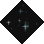 | 506 (0x01FA) | 0 | 17% |
| 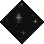 | 507 (0x01FB) | 0 | 17% |
|  | 508 (0x01FC) | 0 | 17% |
| 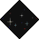 | 509 (0x01FD) | 0 | 17% |
|  | 510 (0x01FE) | 0 | 17% |
| 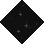 | 511 (0x01FF) | 0 | 17% |

### Statics

_None_

## Invalid

### Tiles

| Tile | ID (Hex) | Z | Chance |
|:----:|:--------:|:--:|:------:|
|  | 172 (0x00AC) | 0 | 25% |
|  | 173 (0x00AD) | 0 | 25% |
|  | 174 (0x00AE) | 0 | 25% |
|  | 175 (0x00AF) | 0 | 25% |

### Statics

_None_
