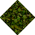
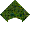

# Jungle to Moss No Statics

_Generated on 2024-12-13 11:26:30_

## Top

### Tiles

| Tile | ID (Hex) | Z | Chance |
|:----:|:--------:|:--:|:------:|
|  | 172 (0x00AC) | 0 | 25% |
|  | 173 (0x00AD) | 0 | 25% |
|  | 174 (0x00AE) | 0 | 25% |
|  | 175 (0x00AF) | 0 | 25% |

### Statics

| Tile | ID (Hex) | Z | Chance |
|:----:|:--------:|:--:|:------:|
|  | 12916 (0x3274) | 0 | 50% |
|  | 12917 (0x3275) | 0 | 50% |

## Left

### Tiles

| Tile | ID (Hex) | Z | Chance |
|:----:|:--------:|:--:|:------:|
|  | 172 (0x00AC) | 0 | 25% |
|  | 173 (0x00AD) | 0 | 25% |
|  | 174 (0x00AE) | 0 | 25% |
|  | 175 (0x00AF) | 0 | 25% |

### Statics

| Tile | ID (Hex) | Z | Chance |
|:----:|:--------:|:--:|:------:|
|  | 12912 (0x3270) | 0 | 50% |
|  | 12913 (0x3271) | 0 | 50% |

## Right

### Tiles

| Tile | ID (Hex) | Z | Chance |
|:----:|:--------:|:--:|:------:|
|  | 172 (0x00AC) | 0 | 25% |
|  | 173 (0x00AD) | 0 | 25% |
|  | 174 (0x00AE) | 0 | 25% |
|  | 175 (0x00AF) | 0 | 25% |

### Statics

| Tile | ID (Hex) | Z | Chance |
|:----:|:--------:|:--:|:------:|
|  | 12918 (0x3276) | 0 | 50% |
|  | 12919 (0x3277) | 0 | 50% |

## Bottom

### Tiles

| Tile | ID (Hex) | Z | Chance |
|:----:|:--------:|:--:|:------:|
|  | 172 (0x00AC) | 0 | 25% |
|  | 173 (0x00AD) | 0 | 25% |
|  | 174 (0x00AE) | 0 | 25% |
|  | 175 (0x00AF) | 0 | 25% |

### Statics

| Tile | ID (Hex) | Z | Chance |
|:----:|:--------:|:--:|:------:|
|  | 12914 (0x3272) | 0 | 50% |
|  | 12915 (0x3273) | 0 | 50% |

## Bottom Right

### Tiles

| Tile | ID (Hex) | Z | Chance |
|:----:|:--------:|:--:|:------:|
|  | 172 (0x00AC) | 0 | 25% |
|  | 173 (0x00AD) | 0 | 25% |
|  | 174 (0x00AE) | 0 | 25% |
|  | 175 (0x00AF) | 0 | 25% |

### Statics

| Tile | ID (Hex) | Z | Chance |
|:----:|:--------:|:--:|:------:|
|  | 12927 (0x327F) | 0 | 100% |

## Top Left

### Tiles

| Tile | ID (Hex) | Z | Chance |
|:----:|:--------:|:--:|:------:|
|  | 172 (0x00AC) | 0 | 25% |
|  | 173 (0x00AD) | 0 | 25% |
|  | 174 (0x00AE) | 0 | 25% |
|  | 175 (0x00AF) | 0 | 25% |

### Statics

| Tile | ID (Hex) | Z | Chance |
|:----:|:--------:|:--:|:------:|
|  | 12925 (0x327D) | 0 | 100% |

## Bottom Left

### Tiles

| Tile | ID (Hex) | Z | Chance |
|:----:|:--------:|:--:|:------:|
|  | 172 (0x00AC) | 0 | 25% |
|  | 173 (0x00AD) | 0 | 25% |
|  | 174 (0x00AE) | 0 | 25% |
|  | 175 (0x00AF) | 0 | 25% |

### Statics

| Tile | ID (Hex) | Z | Chance |
|:----:|:--------:|:--:|:------:|
|  | 12924 (0x327C) | 0 | 100% |

## Top Right

### Tiles

| Tile | ID (Hex) | Z | Chance |
|:----:|:--------:|:--:|:------:|
|  | 172 (0x00AC) | 0 | 25% |
|  | 173 (0x00AD) | 0 | 25% |
|  | 174 (0x00AE) | 0 | 25% |
|  | 175 (0x00AF) | 0 | 25% |

### Statics

| Tile | ID (Hex) | Z | Chance |
|:----:|:--------:|:--:|:------:|
|  | 12926 (0x327E) | 0 | 100% |

## Outer Top Left

### Tiles

| Tile | ID (Hex) | Z | Chance |
|:----:|:--------:|:--:|:------:|
|  | 172 (0x00AC) | 0 | 25% |
|  | 173 (0x00AD) | 0 | 25% |
|  | 174 (0x00AE) | 0 | 25% |
|  | 175 (0x00AF) | 0 | 25% |

### Statics

| Tile | ID (Hex) | Z | Chance |
|:----:|:--------:|:--:|:------:|
|  | 12922 (0x327A) | 0 | 50% |
|  | 12932 (0x3284) | 0 | 50% |

## Outer Bottom Right

### Tiles

| Tile | ID (Hex) | Z | Chance |
|:----:|:--------:|:--:|:------:|
|  | 172 (0x00AC) | 0 | 25% |
|  | 173 (0x00AD) | 0 | 25% |
|  | 174 (0x00AE) | 0 | 25% |
|  | 175 (0x00AF) | 0 | 25% |

### Statics

| Tile | ID (Hex) | Z | Chance |
|:----:|:--------:|:--:|:------:|
|  | 12921 (0x3279) | 0 | 50% |
|  | 12930 (0x3282) | 0 | 50% |

## Outer Top Right

### Tiles

| Tile | ID (Hex) | Z | Chance |
|:----:|:--------:|:--:|:------:|
|  | 172 (0x00AC) | 0 | 25% |
|  | 173 (0x00AD) | 0 | 25% |
|  | 174 (0x00AE) | 0 | 25% |
|  | 175 (0x00AF) | 0 | 25% |

### Statics

| Tile | ID (Hex) | Z | Chance |
|:----:|:--------:|:--:|:------:|
|  | 12923 (0x327B) | 0 | 50% |
|  | 12931 (0x3283) | 0 | 50% |

## Outer Bottom Left

### Tiles

| Tile | ID (Hex) | Z | Chance |
|:----:|:--------:|:--:|:------:|
|  | 172 (0x00AC) | 0 | 25% |
|  | 173 (0x00AD) | 0 | 25% |
|  | 174 (0x00AE) | 0 | 25% |
|  | 175 (0x00AF) | 0 | 25% |

### Statics

| Tile | ID (Hex) | Z | Chance |
|:----:|:--------:|:--:|:------:|
|  | 12920 (0x3278) | 0 | 100% |

## Autocorrect

### Tiles

| Tile | ID (Hex) | Z | Chance |
|:----:|:--------:|:--:|:------:|
|  | 15853 (0x3DED) | 0 | 12% |
|  | 15854 (0x3DEE) | 0 | 38% |
|  | 15855 (0x3DEF) | 0 | 12% |
|  | 15856 (0x3DF0) | 0 | 38% |

### Statics

_None_

## Invalid

### Tiles

| Tile | ID (Hex) | Z | Chance |
|:----:|:--------:|:--:|:------:|
|  | 172 (0x00AC) | 0 | 25% |
|  | 173 (0x00AD) | 0 | 25% |
|  | 174 (0x00AE) | 0 | 25% |
|  | 175 (0x00AF) | 0 | 25% |

### Statics

_None_
